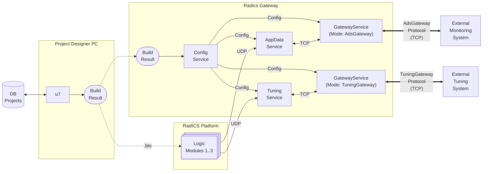

# TuningGateway Protocol Client Example

This is a sample command-line client for the Radiy **TuningGateway**. It demonstrates the [Radiy TuningService Gateway Protocol](../../doc/TuningGatewayProtocolSpec.md) in action, including the handshake, `TuningSources.xml` retrieval, tuning source control, signal reads, value writes, and apply operations.

## Overview

The `GatewayService` can operate in different modes. This example specifically demonstrates its role as a gateway to the Radiy **TuningService**.

### Configuration

For the `GatewayService` to work properly, it must be configured in **u7**. The **ConfigService** reads the build results generated by **u7** and distributes the configuration to other services, including the `GatewayService` and **TuningService**. Both **ConfigService** and **TuningService** must be running for the `GatewayService` to function correctly.

The `GatewayService` requires the following properties to be configured in **u7**:
- **ConfigurationServiceIDs**: The `EquipmentID` of the `ConfigurationService`(s) responsible for configuration delivery to the `GatewayService`.
- **TuningServiceID**: The `EquipmentID` of the `TuningService` that serves as the tuning data source for the `GatewayService`.
- **GatewayDescription**: When the `GatewayService` is operating in `TuningGateway` mode, this property should be configured as follows:

```ini
[Gateway]
GatewayType = TuningGateway           // Specifies the gateway protocol type.
GatewayID = TUNING_GATEWAY_ID
GatewayDescription = TuningGateway description
ClientRequestIP1 = 127.0.0.1:5576     // The binding address and port for client connections.
```

> **Note:** Instructions for configuring and running the `GatewayService` and supporting services (`ConfigService`, `TuningService`) are outside the scope of this example. Please refer to the main project documentation for details on system setup and service management.



The example demonstrates:
- Connecting to a `GatewayService` server.
- Performing the initial handshake.
- Retrieving and parsing `TuningSources.xml`.
- Listing tuning sources and checking their state.
- Reading current values and parameters of tunable signals.
- Activating or deactivating a tuning source.
- Writing new tuning values.
- Applying (committing) written tuning values.
- Setting the current user name for write requests.

The client uses the `GatewayClientLib` library which implements the [Radiy TuningService Gateway Protocol](../../doc/TuningGatewayProtocolSpec.md).

## Requirements

To build this project, you need:
- **CMake** (version 3.16 or higher)
- **C++20** compatible compiler (tested on **GCC 13.3** and **MSVC 2022**)

## Building

```bash
cmake . -B ./build
cmake --build ./build
```

## Running

Before running the example, ensure that the following services are configured, running, and accessible:
- **ConfigService**
- **TuningService**
- **GatewayService**

```bash
./TuningGatewayExample
```

By default, the client attempts to connect to `127.0.0.1:5576`. These settings can be modified in [src/TuningGatewayExample.cpp](src/TuningGatewayExample.cpp).

## Usage

Once connected, the client provides a simple interactive command line:

- `help`, `h`, `?`: Show available commands.
- `user [NAME]`: Show current user or set user name for write commands.
- `param`, `p #SIGNALID`: Retrieve and print detailed parameters for a signal (for example, `p #SIGNAL_1`).
- `value`, `v #SIGNALID`: Retrieve and print the current value and flags for a signal (for example, `v #SIGNAL_1`).
- `ts list`, `ts l`: Print all known tuning sources and their current state.
- `ts status LM_EQUIPMENT_ID`, `ts s LM_EQUIPMENT_ID`: Retrieve and print the state of one tuning source.
- `ts activate LM_EQUIPMENT_ID`, `ts a LM_EQUIPMENT_ID`: Activate control for a tuning source.
- `ts deactivate LM_EQUIPMENT_ID`, `ts d LM_EQUIPMENT_ID`: Deactivate control for a tuning source.
- `write`, `w #SIGNALID=value [#SIGNALID=value ...]`: Write one or more tuning signal values.
- `apply`: Apply (commit) the written tuning signal values.
- `tt`, `t`: Toggle trace logging (useful for seeing raw message exchange).
- `exit`, `bye`, `quit`, `q`: Quit the application.
- `<Enter>`: Repeat the last command.

> **Tip:** If `SingleLmControl = true` in `TuningService`, activate the target tuning source before issuing `write` or `apply` commands.

## Project Structure

- [src/TuningGatewayExample.cpp](src/TuningGatewayExample.cpp): The main entry point and CLI logic for the TuningGateway example.
- [CMakeLists.txt](CMakeLists.txt): CMake build configuration for the example executables.
- [./lib/GatewayClientLib/](./lib/GatewayClientLib/): Core library providing protocol implementation, connection management, and `TuningSources.xml` parsing.

### [GatewayClientLib](./lib/GatewayClientLib/)

This library provides the core logic for communicating with the `GatewayService`.

**Public Headers (`include/GatewayClientLib/`):**
- [TuningGwConnection.hpp](./lib/GatewayClientLib/include/GatewayClientLib/TuningGwConnection.hpp): High-level class to establish and manage the tuning gateway connection.
- [TuningGwProtocol.hpp](./lib/GatewayClientLib/include/GatewayClientLib/TuningGwProtocol.hpp): Definitions of binary protocol structures, request IDs, and status codes.
- [TuningSignalManager.hpp](./lib/GatewayClientLib/include/GatewayClientLib/TuningSignalManager.hpp): Central storage for tuning signal parameters and current states.
- [GwCrc32.hpp](./lib/GatewayClientLib/include/GatewayClientLib/GwCrc32.hpp): CRC32 checksum calculation.
- [GwHash.hpp](./lib/GatewayClientLib/include/GatewayClientLib/GwHash.hpp): Helper for calculating 64-bit hashes of AppSignalIDs.
- [Logger.hpp](./lib/GatewayClientLib/include/GatewayClientLib/Logger.hpp): Simple integration for logging output.
- [ITuningSignalUpdater.hpp](./lib/GatewayClientLib/include/GatewayClientLib/ITuningSignalUpdater.hpp): Interface used to update `TuningSignalManager` data.

**Implementation Details (`src/`):**
- [TuningGwConnImpl.hpp](./lib/GatewayClientLib/src/TuningGwConnImpl.hpp): Internal connection implementation handling the message loop and state machine.
- [TcpConnection.hpp](./lib/GatewayClientLib/src/TcpConnection.hpp): Cross-platform abstraction for TCP sockets.
- [TcpConnWindows.cpp](./lib/GatewayClientLib/src/TcpConnWindows.cpp) / [TcpConnLinux.cpp](./lib/GatewayClientLib/src/TcpConnLinux.cpp): Platform-specific socket implementations.
- [TuningSources.hpp](./lib/GatewayClientLib/src/TuningSources.hpp): Parser interface for `TuningSources.xml`.
- [TuningSources.cpp](./lib/GatewayClientLib/src/TuningSources.cpp): Implementation of `TuningSources.xml` parsing.

## Contact

For any questions or support, please contact the project maintainer at serhiy.malokhatko@radiy.com
