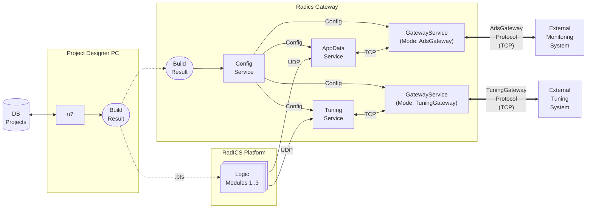

# AdsGateway Protocol Client Example

This is a sample command-line client for the Radiy **AdsGateway**. It demonstrates the [Radiy AppDataService Gateway Protocol](./AdsGatewayProtocolSpec.md) in action, including the handshake, signal synchronization, and real-time data exchange.

## Overview

The `GatewayService` can operate in different modes. This example specifically demonstrates its role as a gateway to the Radiy **AppDataService**.

### Configuration

For the `GatewayService` to work properly, it must be configured in **u7**. The **ConfigService** reads the build results generated by **u7** and distributes the configuration to other services, including the `GatewayService` and **AppDataService**. Both **ConfigService** and **AppDataService** must be running for the `GatewayService` to function correctly.

The `GatewayService` requires the following properties to be configured in **u7**:
- **ConfigurationServiceIDs**: The `EquipmentID` of the `ConfigurationService`(s) responsible for configuration delivery to the `GatewayService`.
- **AppDataServiceIDs**: The `EquipmentID` of the `AppDataService` that serves as the data source for the `GatewayService`.
- **GatewayDescription**: When the `GatewayService` is operating in `AdsGateway` mode, this property should be configured as follows:
```ini
[Gateway]
GatewayType = AdsGateway          // Specifies the gateway protocol type.
GatewayID = ADS_GATEWAY
GatewayDescription = AdsGateway description
ClientRequestIP1 = 127.0.0.1:5566 // The binding address and port for client connections.
```

> **Note:** Instructions for configuring and running the `GatewayService` and supporting services (`ConfigService`, `AppDataService`) are outside the scope of this example. Please refer to the main project documentation for details on system setup and service management.



The example demonstrates:
- Connecting to an `GatewayService` server.
- Performing the initial handshake.
- Synchronizing the signal list and signal parameters.
- Continuously polling for state changes.
- Manually querying specific signal states and parameters.

The client uses the `AdsGatewayLib` library which implements the [Radiy AppDataService Gateway Protocol](AdsGatewayProtocolSpec.md).

## Requirements

To build this project, you need:
- **CMake** (version 3.16 or higher)
- **C++20** compatible compiler (tested on **GCC 13.3** and **MSVC 2022**)

## Building

```bash
mkdir build && cd build
cmake ..
cmake --build .
```

## Running

Before running the example, ensure that the following services are configured, running, and accessible:
- **ConfigService**
- **AppDataService**
- **GatewayService**

```bash
./AdsGatewayExample
```

By default, the client attempts to connect to `127.0.0.1:5566`. These settings can be modified in [src/main.cpp](src/main.cpp).

## Usage

Once connected, the client provides a simple interactive command line:

- `help`, `h`: Show available commands.
- `param`, `p #SIGNALID`: Retrieve and print detailed parameters for a signal (e.g., `p #SIGNAL_1`).
- `value`, `v #SIGNALID`: Retrieve and print the current value and flags for a signal (e.g., `v #SIGNAL_1`).
- `tt`, `t`: Toggle trace logging (useful for seeing raw message exchange).
- `exit`, `q`: Quit the application.
- `<Enter>`: Repeat the last command.

## Project Structure

- [src/main.cpp](src/main.cpp): The main entry point and CLI logic.
- [src/lib/AdsGatewayLib/](src/lib/AdsGatewayLib/): Core library providing protocol implementation and connection management.
- [CMakeLists.txt](CMakeLists.txt): CMake build configuration.

### [AdsGatewayLib](./lib/AdsGatewayLib/)

This library provides the core logic for communicating with the `GatewayService`.

**Public Headers (`include/AdsGatewayLib/`):**
- [AdsGwConnection.hpp](./lib/AdsGatewayLib/include/AdsGatewayLib/AdsGwConnection.hpp): High-level class to establish and manage the gateway connection.
- [AdsGwProtocol.hpp](./lib/AdsGatewayLib/include/AdsGatewayLib/AdsGwProtocol.hpp): Definitions of binary protocol structures, request IDs, and status codes.
- [SignalManager.hpp](./lib/AdsGatewayLib/include/AdsGatewayLib/SignalManager.hpp): Central storage for signal parameters and actual states.
- [GwCrc32.hpp](./lib/AdsGatewayLib/include/AdsGatewayLib/GwCrc32.hpp): CRC32 checksum calculation.
- [GwHash.hpp](./lib/AdsGatewayLib/include/AdsGatewayLib/GwHash.hpp): Helper for calculating 64-bit hashes of AppSignalIDs.
- [Logger.hpp](./lib/AdsGatewayLib/include/AdsGatewayLib/Logger.hpp): Simple integration for logging output.
- [ISignalUpdater.hpp](./lib/AdsGatewayLib/include/AdsGatewayLib/ISignalUpdater.hpp): Interface used to update `SignalManager` data.

**Implementation Details (`src/`):**
- [AdsGwConnImpl.hpp](./lib/AdsGatewayLib/src/AdsGwConnImpl.hpp): Internal connection implementation handling the message loop and state machine.
- [TcpConnection.hpp](./lib/AdsGatewayLib/src/TcpConnection.hpp): Cross-platform abstraction for non-blocking TCP sockets.
- [TcpConnWindows.cpp](./lib/AdsGatewayLib/src/TcpConnWindows.cpp) / [TcpConnLinux.cpp](./lib/AdsGatewayLib/src/TcpConnLinux.cpp): Platform-specific socket implementations.
- [SignalManager.cpp](./lib/AdsGatewayLib/src/SignalManager.cpp): Implementation of signal lookup and storage.

## Contact

For any questions or support, please contact the project maintainer at serhiy.malokhatko@radiy.com
