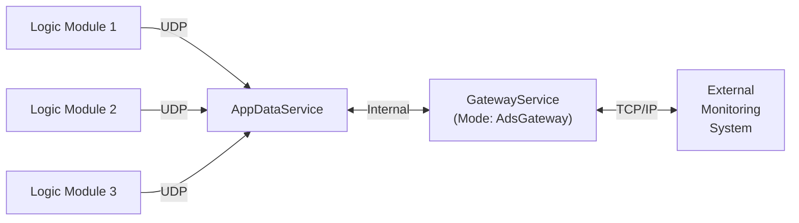
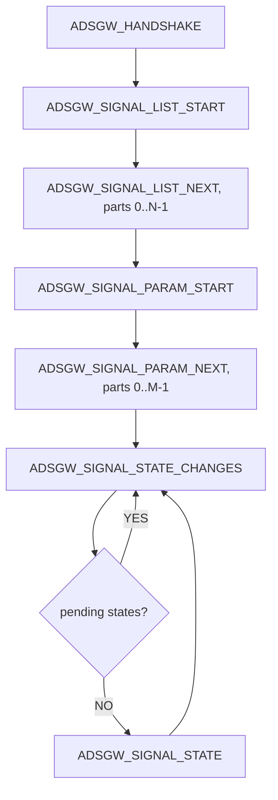

# Radiy AppDataService Gateway Protocol Specification

**Document Version:** 1.3  
**Protocol Version:** 1.0  
**Date:** 18 Mar 2026  
**Authors:** Serhiy Malokhatko, Yuriy Beliy  
**Status:** Released

## Table of Contents

- [1. Introduction](#1-introduction)
    - [1.1 Purpose](#11-purpose)
    - [1.2 Scope](#12-scope)
    - [1.3 System Overview](#13-system-overview)
- [2. Connection Specification](#2-connection-specification)
    - [2.1 Transport Protocol](#21-transport-protocol)
    - [2.2 Connection Establishment](#22-connection-establishment)
    - [2.3 Connection Management](#23-connection-management)
- [3. Message Structure](#3-message-structure)
    - [3.1 General Message Format](#31-general-message-format)
    - [3.2 Field Descriptions](#32-field-descriptions)
    - [3.3 Byte Order](#33-byte-order)
    - [3.4 CRC32 Calculation](#34-crc32-calculation)
    - [3.5 Error Response Structure](#35-error-response-structure)
- [4. Request IDs and Operations](#4-request-ids-and-operations)
    - [4.1 Request ID List](#41-request-id-list)
    - [4.2 Response Convention](#42-response-convention)
- [5. Signal Identification](#5-signal-identification)
    - [5.1 AppSignalID](#51-appsignalid)
    - [5.2 AppSignalID Hash](#52-appsignalid-hash)
- [6. Request/Response Specifications](#6-requestresponse-specifications)
    - [6.1 ADSGW_HANDSHAKE](#61-adsgw_handshake)
    - [6.2 ADSGW_SIGNAL_LIST_START / ADSGW_SIGNAL_LIST_NEXT](#62-adsgw_signal_list_start--adsgw_signal_list_next)
    - [6.3 ADSGW_SIGNAL_PARAM_START / ADSGW_SIGNAL_PARAM_NEXT](#63-adsgw_signal_param_start--adsgw_signal_param_next)
    - [6.4 ADSGW_SIGNAL_STATE](#64-adsgw_signal_state)
    - [6.5 ADSGW_SIGNAL_STATE_CHANGES](#65-adsgw_signal_state_changes)
- [7. Data Structures](#7-data-structures)
    - [7.1 GwAppSignalParam Structure](#71-gwappsignalparam-structure)
    - [7.2 GwAppSignalState Structure](#72-gwappsignalstate-structure)
    - [7.3 Channel Codes](#73-channel-codes)
    - [7.4 Signal I/O Type Codes](#74-signal-io-type-codes)
    - [7.5 Signal Type Codes](#75-signal-type-codes)
- [8. Error Handling](#8-error-handling)
    - [8.1 Error Response Format](#81-error-response-format)
    - [8.2 Error Codes](#82-error-codes)
- [9. Redundancy and Reliability](#9-redundancy-and-reliability)
    - [9.1 Data Source Redundancy](#91-data-source-redundancy)
    - [9.2 Connection Redundancy](#92-connection-redundancy)
- [Appendices](#appendices)
    - [Appendix A: Example Message Flows](#appendix-a-example-message-flows)
    - [Appendix B: CRC32 Reference Implementation](#appendix-b-crc32-reference-implementation)
- [Document Revision History](#document-revision-history)

---

<a id="1-introduction" name="1-introduction"></a>
## 1. Introduction

<a id="11-purpose" name="11-purpose"></a>
### 1.1 Purpose
This document specifies the communication protocol between Radiy's Gateway software operating in AdsGateway (AppDataService gateway) mode and external monitoring systems.

**Protocol Version Scope:** This document describes **Protocol Version 1.0**.

<a id="12-scope" name="12-scope"></a>
### 1.2 Scope
The protocol defines the message structure, request/response patterns, and data exchange mechanisms for signal monitoring and state management in industrial automation environments.

<a id="13-system-overview" name="13-system-overview"></a>
### 1.3 System Overview



> **Note:** In this document, when we refer to `AdsGateway` or `Gateway`, we mean the `Gateway` program configured to work in mode `AdsGateway`.

The AdsGateway acts as a bridge between Radiy's equipment and external monitoring systems, providing:
- Signal parameter retrieval
- Signal state monitoring
- State change retrieval
- Redundant data source management

---

<a id="2-connection-specification" name="2-connection-specification"></a>
## 2. Connection Specification

<a id="21-transport-protocol" name="21-transport-protocol"></a>
### 2.1 Transport Protocol
- **Protocol:** TCP/IP
- **Default Port:** 5566 (configurable)
- **Connection Model:** Server/Client
  - **Server:** Radiy Gateway in AdsGateway mode
  - **Client:** External Monitoring System
- **Connection Mode:** Persistent connection with keep-alive
- **Maximum payload size:** 2 MB

**Data Integrity:**
TCP provides built-in transport-level data integrity and reliability. Additionally, this protocol implements application-level CRC32 checksums ([Section 3.4](#34-crc32-calculation)) for end-to-end message integrity verification.

<a id="22-connection-establishment" name="22-connection-establishment"></a>
### 2.2 Connection Establishment
1. Client initiates TCP connection to AdsGateway on configured port
2. Client sends `ADSGW_HANDSHAKE` request
3. AdsGateway validates and responds with handshake acknowledgment
4. Connection is established and ready for data exchange

<a id="23-connection-management" name="23-connection-management"></a>
### 2.3 Connection Management
- Client is responsible for maintaining connection
- Heartbeat/keep-alive mechanism recommended
- Automatic reconnection on connection loss should be implemented by client

---

<a id="3-message-structure" name="3-message-structure"></a>
## 3. Message Structure

<a id="31-general-message-format" name="31-general-message-format"></a>
### 3.1 General Message Format
All messages (requests and responses) follow this binary structure:

```
+------------------+------------------+------------------+------------------+------------------+
| Request ID       | Payload Size     | Status Code      | Payload          | CRC32            |
| (4 bytes)        | (4 bytes)        | (4 bytes)        | (variable)       | (4 bytes)        |
+------------------+------------------+------------------+------------------+------------------+
```

**Protocol Version Handling:**
- Server implements a single fixed protocol version (see document header)
- Protocol version is verified during the `ADSGW_HANDSHAKE` exchange ([Section 6.1](#61-adsgw_handshake))
- Client and server must use identical protocol versions - no negotiation or compatibility layer
- Version mismatch during handshake results in connection rejection

**Request/Response Flow:**
- Client sends a request with a specific Request ID, Status Code = 0, and request-specific payload
- Server responds with the same Request ID, Status Code indicating success or error, and response-specific payload
- Status Code = 0 indicates success; non-zero values indicate errors (see [Section 8.2](#82-error-codes))
- Client examines Status Code to determine if payload is present

<a id="32-field-descriptions" name="32-field-descriptions"></a>
### 3.2 Field Descriptions

| Field | Size | Type | Description |
|-------|------|------|-------------|
| Request ID | 4 bytes | uint32 | Identifies the request/response type |
| Payload Size | 4 bytes | uint32 | Size of the payload in bytes (0 for errors, excluding header and CRC) |
| Status Code | 4 bytes | uint32 | 0 = success, non-zero = error code (see [Section 8.2](#82-error-codes)) |
| Payload | Variable | Binary | Request/response specific data (present only when Status Code = 0) |
| CRC32 | 4 bytes | uint32 | CRC32 checksum of entire message (excluding CRC field itself) |

**Payload Interpretation:**
- **Requests:** Payload contains request-specific data (see [Section 6](#6-requestresponse-specifications))
- **Success Responses (Status Code = 0):** Payload contains operation-specific success data (see [Section 6](#6-requestresponse-specifications))
- **Error Responses (Status Code ≠ 0):** Payload is not present

<a id="33-byte-order" name="33-byte-order"></a>
### 3.3 Byte Order
- **Endianness:** Little-endian (all multi-byte fields)
- **Floating-point format:** IEEE 754

<a id="34-crc32-calculation" name="34-crc32-calculation"></a>
### 3.4 CRC32 Calculation
- **Algorithm:** CRC-32 (IEEE 802.3 polynomial: 0x04C11DB7, reflected: 0xEDB88320)
- **Input reflection**: yes (process least-significant bit first; equivalent to reflecting each byte)
- **Output reflection**: yes (falls out of reflected processing)
- **Initial Value:** 0xFFFFFFFF
- **Final XOR:** 0xFFFFFFFF
- **Calculation Range:** From Request ID through end of Payload

For reference implementation, see [Appendix B](#appendix-b-crc32-reference-implementation).

<a id="35-error-response-structure" name="35-error-response-structure"></a>
### 3.5 Error Response Structure
**When Status Code is non-zero (error condition):**
- Payload Size = 0 (no payload data)
- Error code is indicated only by the Status Code field value (see [Section 8.2](#82-error-codes))
- No additional error message or data is transmitted

**Special Cases:**
- Unknown Request ID: Server responds with the unknown Request ID and Status Code = `GWC_INVALID_REQUEST`
- Malformed Request: Server may respond with Status Code = `GWC_REQUEST_FORMAT_ERROR`
- CRC Failure: Server may respond with Status Code = `GWC_CRC_ERROR`

---

<a id="4-request-ids-and-operations" name="4-request-ids-and-operations"></a>
## 4. Request IDs and Operations

<a id="41-request-id-list" name="41-request-id-list"></a>
### 4.1 Request ID List

| Request ID | Value (hex) | Description |
|------------|-------------|-------------|
| ADSGW_HANDSHAKE | 0x0001 | Initial handshake |
| ADSGW_SIGNAL_LIST_START | 0x0100 | Start retrieving list of AppSignalIDs |
| ADSGW_SIGNAL_LIST_NEXT | 0x0101 | Continue retrieving list of AppSignalIDs |
| ADSGW_SIGNAL_PARAM_START | 0x0200 | Start retrieving signal parameters |
| ADSGW_SIGNAL_PARAM_NEXT | 0x0201 | Continue retrieving signal parameters |
| ADSGW_SIGNAL_STATE | 0x0300 | Request signal states |
| ADSGW_SIGNAL_STATE_CHANGES | 0x0301 | Request signal state changes |

<a id="42-response-convention" name="42-response-convention"></a>
### 4.2 Response Convention
- Response uses the same Request ID as the corresponding request
- **Status Code field indicates success (0) or error (non-zero)**
- Status Code = 0: Payload contains operation-specific success data (see [Section 6](#6-requestresponse-specifications))
- Status Code ≠ 0: No payload, Payload Size = 0 (see [Section 8.2](#82-error-codes) for error codes)

---

<a id="5-signal-identification" name="5-signal-identification"></a>
## 5. Signal Identification

<a id="51-appsignalid" name="51-appsignalid"></a>
### 5.1 AppSignalID
- **Type:** C-style null-terminated string (ASCII encoding)
- **Character Set:** Limited to ASCII characters: `#`, `A-Z`, `a-z`, `0-9`, `_` (underscore), `.` (dot)
- **Format:** Must always start with `#` character
- **Maximum Length:** 128 bytes including null terminator (127 usable characters + `\0`)
- **Uniqueness:** Unique within the system
- **Special Characters:**
  - **`#`** - Mandatory prefix for all AppSignalIDs
  - **`.` (dot)** - Special separator used in generated signals from the Bus signal (e.g., `#BUSSIGNALID.subsignal`)
  - **`_` (underscore)** - General-purpose separator

<a id="52-appsignalid-hash" name="52-appsignalid-hash"></a>
### 5.2 AppSignalID Hash
- **Algorithm:** Custom hash algorithm (see implementation below)
- **HashType:** uint64 (64-bit unsigned integer)
- **Hash Input:** The entire AppSignalID string including the leading `#` but excluding the null terminator
- **Uniqueness Guarantee:** The system ensures uniqueness by validating the set of AppSignalIDs during configuration to detect and prevent hash collisions.

**Hash Calculation Reference Implementation:**

```cpp
#pragma once

#include <cstdint>
#include <string_view>

using Hash = uint64_t;

inline constexpr Hash UNDEFINED_HASH = 0x0000000000000000ULL;

/**
 * Calculate hash for AppSignalID
 *
 * @param str - String view of AppSignalID (must start with '#', ASCII characters only)
 * @param init - Initial hash value (default: 0)
 * @return Hash - 64-bit hash value
 * 
 * Example:
 *   std::string_view signalId = "#APPSIGNALID_1SF";
 *   Hash hash = calcHash(signalId);
 */
[[nodiscard]] constexpr Hash calcHash(std::string_view str, Hash init = 0ULL)
{
    Hash hash = init;

    for (char c : str)
    {
        uint16_t unicode = static_cast<unsigned char>(c);
        hash += (hash << 5) + unicode;
    }

    return hash;
}
```

---

<a id="6-requestresponse-specifications" name="6-requestresponse-specifications"></a>
## 6. Request/Response Specifications

**Request Prerequisites:**
- All requests except `ADSGW_HANDSHAKE` require that a successful handshake has been completed.
- If the client has not completed the handshake, the server will respond with Status Code = `GWC_HANDSHAKE_REQUIRED` and no payload.
- Requests `ADSGW_SIGNAL_STATE` and `ADSGW_SIGNAL_STATE_CHANGES` require the AdsGateway to be connected to AppDataService. For these requests, if AdsGateway is not connected, the server responds with Status Code = `GWC_NO_ADS_CONNECTION` and no payload.

<a id="61-adsgw_handshake" name="61-adsgw_handshake"></a>
### 6.1 ADSGW_HANDSHAKE

#### Purpose
Initial connection handshake to establish protocol version and capabilities.

**Protocol Version Negotiation:**
- Server implements a single fixed protocol version (no multi-version support)
- Client specifies the protocol version it supports in the request
- Server compares client version with its own implemented version:
  - Match: Server responds with Status Code = 0 and handshake succeeds
  - Mismatch: Server responds with Status Code = `GWC_UNSUPPORTED_VERSION` and connection should be closed
- No version negotiation or downgrading - client and server must use identical protocol versions
- Server and client are incompatible if protocol versions differ

#### Request Payload
```
struct GwHandshakeRequest {
    uint16_t protocolVersion;  // Protocol version client supports (e.g., 0x0100 for v1.0)
    uint16_t reserved1;        // Reserved for future use
    char clientName[128];      // Null-terminated client name
};

static_assert(sizeof(GwHandshakeRequest) == 132);
```

| Offset | Size | Type | Field |
|--------|------|------|-------|
| 0 | 2 | `uint16_t` | `protocolVersion` |
| 2 | 2 | `uint16_t` | `reserved1` |
| 4 | 128 | `char[128]` | `clientName` |

Total size: 132 bytes

**Protocol Version Format:** 0xMMmm where MM = major version, mm = minor version
- Example: 0x0100 = Version 1.0 (current)
- Example: 0x0101 = Version 1.1
- Example: 0x0200 = Version 2.0

#### Response Payload (Success: Status Code = 0)
```
struct GwHandshakeResponse {
    uint16_t protocolVersion;          // Server protocol version (must match request for success)
    uint16_t reserved;                 // Reserved (must be 0)

    uint32_t maxStateRequest;          // Max signal states per request (ADSGW_SIGNAL_STATE)

    // Structure size compatibility fields (bytes)
    uint32_t sizeof_GwAppSignalParam;  // See Section 7.1
    uint32_t sizeof_GwAppSignalState;  // See Section 7.2
};

static_assert(sizeof(GwHandshakeResponse) == 16);
```

| Offset | Size | Type | Field |
|--------|------|------|-------|
| 0 | 2 | `uint16_t` | `protocolVersion` |
| 2 | 2 | `uint16_t` | `reserved` |
| 4 | 4 | `uint32_t` | `maxStateRequest` |
| 8 | 4 | `uint32_t` | `sizeof_GwAppSignalParam` |
| 12 | 4 | `uint32_t` | `sizeof_GwAppSignalState` |

Total size: 16 bytes

**Expected Size Field Values (Protocol v1.0):**

| Field | Expected value (bytes) | Notes |
|------|-------------------------|-------|
| `sizeof_GwAppSignalParam` | 1208 | See [Section 7.1](#71-gwappsignalparam-structure) |
| `sizeof_GwAppSignalState` | 48 | See [Section 7.2](#72-gwappsignalstate-structure) |

**Compatibility Check (Client):**
- Client can compare `sizeof_GwAppSignalParam` and `sizeof_GwAppSignalState` against its locally compiled `sizeof(GwAppSignalParam)` and `sizeof(GwAppSignalState)`.
- A mismatch indicates protocol incompatibility (likely packing/alignment or definition mismatch) and the client should reject the connection.
- If client version == server version: Status Code = 0, handshake response with matching version
- If client version ≠ server version: Status Code = `GWC_UNSUPPORTED_VERSION`, no payload

---

<a id="62-adsgw_signal_list_start--adsgw_signal_list_next" name="62-adsgw_signal_list_start--adsgw_signal_list_next"></a>
### 6.2 ADSGW_SIGNAL_LIST_START / ADSGW_SIGNAL_LIST_NEXT

#### Purpose
Retrieve complete list of all AppSignalIDs (Application Signal Identifiers) available in the system. Uses pagination for large signal sets.

#### Request Payload (ADSGW_SIGNAL_LIST_START)
```
struct GwSignalListStartRequest {
    uint32_t reserved;
};

static_assert(sizeof(GwSignalListStartRequest) == 4);
```

| Offset | Size | Type | Field |
|--------|------|------|-------|
| 0 | 4 | `uint32_t` | `reserved` |

Total size: 4 bytes

#### Response Payload (ADSGW_SIGNAL_LIST_START)
```
struct GwSignalListStartResponse {
    uint32_t totalItemCount;    // Total number of AppSignalIDs in system
    uint32_t partCount;         // Total number of parts (pages) to retrieve
    uint32_t itemsPerPart;      // Maximum number of AppSignalIDs per part
};

static_assert(sizeof(GwSignalListStartResponse) == 12);
```

| Offset | Size | Type | Field |
|--------|------|------|-------|
| 0 | 4 | `uint32_t` | `totalItemCount` |
| 4 | 4 | `uint32_t` | `partCount` |
| 8 | 4 | `uint32_t` | `itemsPerPart` |

Total size: 12 bytes

**Usage:**
- Client sends `ADSGW_SIGNAL_LIST_START` to initiate list retrieval
- Server responds with pagination information (total count, number of parts, items per part)
- Client then uses `ADSGW_SIGNAL_LIST_NEXT` to retrieve each part sequentially

---

#### Request Payload (ADSGW_SIGNAL_LIST_NEXT)
```
struct GwSignalListNextRequest {
    uint32_t part;              // Part number to retrieve (0-based index)
};

static_assert(sizeof(GwSignalListNextRequest) == 4);
```

| Offset | Size | Type | Field |
|--------|------|------|-------|
| 0 | 4 | `uint32_t` | `part` |

Total size: 4 bytes

**Part Number:**
- Valid range: 0 to (partCount - 1)
- Client should retrieve parts sequentially: part=0, part=1, ..., part=(partCount-1)

#### Response Payload (ADSGW_SIGNAL_LIST_NEXT)
```
struct GwSignalListNextResponse {
    uint32_t part;              // Part number of this response
    uint32_t appSignalIdCount;  // Number of AppSignalIDs in this response
    
    // Array of AppSignalID strings
    struct {
        char appSignalId[128];  // AppSignalID (null-terminated, max 128 bytes including '\0')
    } appSignalIds[appSignalIdCount];
};
```

| Offset | Size | Type | Field |
|--------|------|------|-------|
| 0 | 4 | `uint32_t` | `part` |
| 4 | 4 | `uint32_t` | `appSignalIdCount` |
| 8 | `appSignalIdCount * 128` | `char[128]` | `appSignalIds[]` |

Total size: `8 + (appSignalIdCount * 128)` bytes

**Response Behavior:**
- Server returns the requested part number along with the AppSignalIDs for that part
- Each AppSignalID is a C-style null-terminated string with fixed 128-byte size (as defined in [Section 5.1](#51-appsignalid))
- Last part may contain fewer items than `itemsPerPart` if total count is not evenly divisible

**Example Flow:**
```
Client -> Server: ADSGW_SIGNAL_LIST_START ()
Server -> Client: ADSGW_SIGNAL_LIST_START (totalItemCount=1250, partCount=3, itemsPerPart=500)

Client -> Server: ADSGW_SIGNAL_LIST_NEXT (part=0)
Server -> Client: ADSGW_SIGNAL_LIST_NEXT (part=0, 500 AppSignalIDs)

Client -> Server: ADSGW_SIGNAL_LIST_NEXT (part=1)
Server -> Client: ADSGW_SIGNAL_LIST_NEXT (part=1, 500 AppSignalIDs)

Client -> Server: ADSGW_SIGNAL_LIST_NEXT (part=2)
Server -> Client: ADSGW_SIGNAL_LIST_NEXT (part=2, 250 AppSignalIDs)
```

---

<a id="63-adsgw_signal_param_start--adsgw_signal_param_next" name="63-adsgw_signal_param_start--adsgw_signal_param_next"></a>
### 6.3 ADSGW_SIGNAL_PARAM_START / ADSGW_SIGNAL_PARAM_NEXT

#### Purpose
Retrieve detailed descriptions and parameters for all signals. Uses pagination similar to signal list retrieval.

For the complete `GwAppSignalParam` structure definition, see [Section 7.1](#71-gwappsignalparam-structure).

---

#### Request Payload (ADSGW_SIGNAL_PARAM_START)
```
struct GwSignalParamStartRequest {
    uint32_t reserved;
};

static_assert(sizeof(GwSignalParamStartRequest) == 4);
```

| Offset | Size | Type | Field |
|--------|------|------|-------|
| 0 | 4 | `uint32_t` | `reserved` |

Total size: 4 bytes

#### Response Payload (ADSGW_SIGNAL_PARAM_START)
```
struct GwSignalParamStartResponse {
    uint32_t totalItemCount;    // Total number of GwAppSignalParams in system
    uint32_t partCount;         // Total number of parts (pages) to retrieve
    uint32_t itemsPerPart;      // Maximum number of GwAppSignalParams per part
};

static_assert(sizeof(GwSignalParamStartResponse) == 12);
```

| Offset | Size | Type | Field |
|--------|------|------|-------|
| 0 | 4 | `uint32_t` | `totalItemCount` |
| 4 | 4 | `uint32_t` | `partCount` |
| 8 | 4 | `uint32_t` | `itemsPerPart` |

Total size: 12 bytes

**Usage:**
- Client sends `ADSGW_SIGNAL_PARAM_START` to initiate parameter retrieval
- Server responds with pagination information (total count, number of parts, items per part)
- Client then uses `ADSGW_SIGNAL_PARAM_NEXT` to retrieve each part sequentially

---

#### Request Payload (ADSGW_SIGNAL_PARAM_NEXT)
```
struct GwSignalParamNextRequest {
    uint32_t part;              // Part number to retrieve (0-based index)
};

static_assert(sizeof(GwSignalParamNextRequest) == 4);
```

| Offset | Size | Type | Field |
|--------|------|------|-------|
| 0 | 4 | `uint32_t` | `part` |

Total size: 4 bytes

**Part Number:**
- Valid range: 0 to (partCount - 1)
- Client should retrieve parts sequentially: part=0, part=1, ..., part=(partCount-1)

#### Response Payload (ADSGW_SIGNAL_PARAM_NEXT)
```
struct GwSignalParamNextResponse {
    uint32_t part;              // Part number of this response
    uint32_t paramCount;        // Number of GwAppSignalParams in this response
    
    // Array of GwAppSignalParam structures
    GwAppSignalParam params[paramCount];
};
```

| Offset | Size | Type | Field |
|--------|------|------|-------|
| 0 | 4 | `uint32_t` | `part` |
| 4 | 4 | `uint32_t` | `paramCount` |
| 8 | `paramCount * sizeof(GwAppSignalParam)` | `GwAppSignalParam` | `params[]` |

Total size: `8 + (paramCount * sizeof(GwAppSignalParam))` bytes

**Response Behavior:**
- Server returns the requested part number along with the GwAppSignalParams for that part
- Each GwAppSignalParam follows the structure defined above
- Last part may contain fewer items than `itemsPerPart` if total count is not evenly divisible

**Example Flow:**
```
Client -> Server: ADSGW_SIGNAL_PARAM_START ()
Server -> Client: ADSGW_SIGNAL_PARAM_START (totalItemCount=1200, partCount=3, itemsPerPart=500)

Client -> Server: ADSGW_SIGNAL_PARAM_NEXT (part=0)
Server -> Client: ADSGW_SIGNAL_PARAM_NEXT (part=0, 500 GwAppSignalParams)

Client -> Server: ADSGW_SIGNAL_PARAM_NEXT (part=1)
Server -> Client: ADSGW_SIGNAL_PARAM_NEXT (part=1, 500 GwAppSignalParams)

Client -> Server: ADSGW_SIGNAL_PARAM_NEXT (part=2)
Server -> Client: ADSGW_SIGNAL_PARAM_NEXT (part=2, 200 GwAppSignalParams)
```

---

<a id="64-adsgw_signal_state" name="64-adsgw_signal_state"></a>
### 6.4 ADSGW_SIGNAL_STATE

#### Purpose
Request current states of specific signals by their hashes.

For the complete `GwAppSignalState` structure definition, see [Section 7.2](#72-gwappsignalstate-structure).

---

#### Request Payload
```
struct GwSignalStateRequest {
    uint32_t signalCount;               // Number of signals requested
    uint32_t reserved1;                 // Reserved for future use
    uint64_t signalHashes[signalCount]; // Array of signal hashes
};
```

| Offset | Size | Type | Field |
|--------|------|------|-------|
| 0 | 4 | `uint32_t` | `signalCount` |
| 4 | 4 | `uint32_t` | `reserved1` |
| 8 | `signalCount * 8` | `uint64_t` | `signalHashes[]` |

Total size: `8 + (signalCount * 8)` bytes

**Request Behavior:**
- Client specifies an array of signal hashes to request
- Maximum number of signals per request: The `signalCount` must not exceed the `maxStateRequest` value received in the `GwHandshakeResponse` ([Section 6.1](#61-adsgw_handshake)). Requests exceeding this limit will result in error code `GWC_TOO_MANY_SIGNALS`.
- This request requires the AdsGateway to be connected to AppDataService. If the AdsGateway is not connected, the server responds with Status Code = `GWC_NO_ADS_CONNECTION` and no payload.

#### Response Payload
```
struct GwSignalStateResponse {
    uint32_t stateCount;        // Number of states returned
    uint32_t reserved1;         // Reserved for future use
    
    // Array of GwAppSignalState structures
    GwAppSignalState states[stateCount];
};
```

| Offset | Size | Type | Field |
|--------|------|------|-------|
| 0 | 4 | `uint32_t` | `stateCount` |
| 4 | 4 | `uint32_t` | `reserved1` |
| 8 | `stateCount * sizeof(GwAppSignalState)` | `GwAppSignalState` | `states[]` |

Total size: `8 + (stateCount * sizeof(GwAppSignalState))` bytes

**Response Behavior:**
- Server returns states for all found signals
- States are returned in the same order as requested hashes (for found signals only)
- `stateCount` may be less than requested `signalCount` if some signal hashes are not found
- Missing signals: If a requested signal hash is not found in the system, no error is reported. The signal is simply skipped in the response. 
- If none of the requested signals are found, `stateCount` will be 0 (empty response, but Status Code = 0)

**Example Flow:**
```
// All signals found
Client -> Server: ADSGW_SIGNAL_STATE (signalCount=3, hashes=[0x123, 0x456, 0x789])
Server -> Client: ADSGW_SIGNAL_STATE (Status=0, stateCount=3, states=[...])

// One signal not found (0x999 doesn't exist)
Client -> Server: ADSGW_SIGNAL_STATE (signalCount=3, hashes=[0x123, 0x456, 0x999])
Server -> Client: ADSGW_SIGNAL_STATE (Status=0, stateCount=2, states=[0x123, 0x456])

// No signals found
Client -> Server: ADSGW_SIGNAL_STATE (signalCount=2, hashes=[0x999, 0x888])
Server -> Client: ADSGW_SIGNAL_STATE (Status=0, stateCount=0)
```

---

<a id="65-adsgw_signal_state_changes" name="65-adsgw_signal_state_changes"></a>
### 6.5 ADSGW_SIGNAL_STATE_CHANGES

#### Purpose
Fetch accumulated signal state changes from the server's queue for the client connection.

**Change Detection:**
A signal is considered "changed" when:
- Any flag bit changes (validity, limits, simulation, etc.)
- Value changes by the configured aperture
- Periodic records are generated based on AppDataService configuration

**Queue Behavior:**
- Server maintains a separate state change queue for each client connection
- This request fetches and returns accumulated changes from the client's queue
 - Queue size is limited; older changes may be dropped if client doesn't poll frequently enough

---

#### Request Payload
```
struct GwSignalStateChangesRequest {
    uint32_t reserved;
};

static_assert(sizeof(GwSignalStateChangesRequest) == 4);
```

| Offset | Size | Type | Field |
|--------|------|------|-------|
| 0 | 4 | `uint32_t` | `reserved` |

Total size: 4 bytes

**Request Behavior:**
- Client sends request to retrieve accumulated state changes
- Server returns pending changes from the client's dedicated queue
- This request requires the AdsGateway to be connected to AppDataService. If the AdsGateway is not connected, the server responds with Status Code = `GWC_NO_ADS_CONNECTION` and no payload.

---

#### Response Payload
```
struct GwSignalStateChangesResponse {
    uint32_t pendingStatesCount; // Number of state changes still in queue 
                                 // (not returned in this response)
    uint32_t stateCount;         // Number of states in this response
    
    // Array of GwAppSignalState structures
    GwAppSignalState states[stateCount];
};
```

| Offset | Size | Type | Field |
|--------|------|------|-------|
| 0 | 4 | `uint32_t` | `pendingStatesCount` |
| 4 | 4 | `uint32_t` | `stateCount` |
| 8 | `stateCount * sizeof(GwAppSignalState)` | `GwAppSignalState` | `states[]` |

Total size: `8 + (stateCount * sizeof(GwAppSignalState))` bytes

**Response Behavior:**
- `pendingStatesCount`: Indicates how many additional state changes remain in the queue after this response
- If >= `GwHandshakeResponse.maxStateRequest`: Client should immediately request again to retrieve remaining changes
- `stateCount`: Number of state changes included in this response
- `states`: Array of changed signal states, each following the `GwAppSignalState` structure ([Section 7.2](#72-gwappsignalstate-structure))
- States are returned in chronological order (oldest changes first)

**Recommended Polling Strategy:**
- Poll at regular intervals (20ms - 200ms depending on application requirements)
- If `pendingStatesCount >= GwHandshakeResponse.maxStateRequest`, request again immediately without waiting
- Continue requesting until `pendingStatesCount < GwHandshakeResponse.maxStateRequest`
- Adjust polling rate based on system load and change frequency

---

<a id="7-data-structures" name="7-data-structures"></a>
## 7. Data Structures

<a id="71-gwappsignalparam-structure" name="71-gwappsignalparam-structure"></a>
### 7.1 GwAppSignalParam Structure

The `GwAppSignalParam` structure contains detailed parameters and metadata for each signal.

```cpp
struct GwAppSignalParam {
    uint64_t hash;              // Signal hash (as defined in Section 5.2)
    char appSignalId[128];      // AppSignalID (ASCII, null-terminated, as defined in Section 5.1)
    char customSignalId[128];   // Custom Signal ID (UTF-8, null-terminated)

    char caption[256];          // Signal caption/description (UTF-8, null-terminated)
    char equipmentId[128];      // EquipmentID (ASCII, null-terminated)
    char lmEquipmentId[128];    // LogicModule EquipmentID (ASCII, null-terminated)
    char units[128];            // Engineering units (UTF-8, null-terminated)
    char tags[256];             // Tags, space-separated (ASCII, null-terminated)

    uint8_t channel;            // Channel code (see Section 7.3)
    uint8_t inOutType;          // I/O type code (see Section 7.4)
    uint8_t type;               // Signal type code (see Section 7.5)
    uint8_t decimalPlaces;      // Number of decimal places for analog signals

    uint8_t tuning;             // Tuning flag (0 = non-tunable, 1 = tunable)
    uint8_t reserved1;
    uint8_t reserved2;
    uint8_t reserved3;

    double lowValidRange;       // Low valid range for analog signals
    double highValidRange;      // High valid range for analog signals

    double tuningDefaultValue;  // Default tuning value
    double tuningLowBound;      // Low bound for tuning value
    double tuningHighBound;     // High bound for tuning value
};

static_assert(sizeof(GwAppSignalParam) == 1208);
```

| Offset | Size | Type | Field |
|--------|------|------|-------|
| 0 | 8 | `uint64_t` | `hash` |
| 8 | 128 | `char[128]` | `appSignalId` |
| 136 | 128 | `char[128]` | `customSignalId` |
| 264 | 256 | `char[256]` | `caption` |
| 520 | 128 | `char[128]` | `equipmentId` |
| 648 | 128 | `char[128]` | `lmEquipmentId` |
| 776 | 128 | `char[128]` | `units` |
| 904 | 256 | `char[256]` | `tags` |
| 1160 | 1 | `uint8_t` | `channel` |
| 1161 | 1 | `uint8_t` | `inOutType` |
| 1162 | 1 | `uint8_t` | `type` |
| 1163 | 1 | `uint8_t` | `decimalPlaces` |
| 1164 | 1 | `uint8_t` | `tuning` |
| 1165 | 1 | `uint8_t` | `reserved1` |
| 1166 | 1 | `uint8_t` | `reserved2` |
| 1167 | 1 | `uint8_t` | `reserved3` |
| 1168 | 8 | `double` | `lowValidRange` |
| 1176 | 8 | `double` | `highValidRange` |
| 1184 | 8 | `double` | `tuningDefaultValue` |
| 1192 | 8 | `double` | `tuningLowBound` |
| 1200 | 8 | `double` | `tuningHighBound` |

Total size: 1208 bytes

**String Field Encoding:**
- ASCII (7-bit) fields: `appSignalId`, `equipmentId`, `lmEquipmentId`, `tags`
- UTF-8 fields: `customSignalId`, `caption`, `units`
- All strings are null-terminated C-style strings with fixed maximum lengths as shown above

---

<a id="72-gwappsignalstate-structure" name="72-gwappsignalstate-structure"></a>
### 7.2 GwAppSignalState Structure

The `GwAppSignalState` structure contains the current state and value of a signal.

```cpp
struct GwAppSignalState {
    uint64_t hash;                    // Signal hash (as defined in Section 5.2)
    int64_t  systemTime;              // Server system time (UTC+0) when the state was acquired
    int64_t  localTime;               // systemTime adjusted to Local time zone
    int64_t  plantTime;               // Timestamp assigned in LogicModule (local time zone)
    double   value;                   // Signal value (for discrete: 0=false, 1=true)
    uint32_t flags;                   // State flags (see Section 7.3 for bit definitions)
    uint32_t reserved;                // Reserved for future use
};

static_assert(sizeof(GwAppSignalState) == 48);
```
| Offset | Size | Type | Field |
|--------|------|------|-------|
| 0 | 8 | `uint64_t` | `hash` |
| 8 | 8 | `int64_t` | `systemTime` |
| 16 | 8 | `int64_t` | `localTime` |
| 24 | 8 | `int64_t` | `plantTime` |
| 32 | 8 | `double` | `value` |
| 40 | 4 | `uint32_t` | `flags` |
| 44 | 4 | `uint32_t` | `reserved` |

Total size: 48 bytes

All timestamps representing milliseconds since Unix epoch (1970-01-01 00:00:00 UTC).

**Value Field:**
- For **analog signals**: Contains the actual measured/calculated value
- For **discrete signals**: 0 = false/off, 1 = true/on
- For **bus signals**: Bus signals themselves do not have state values. During project compilation, bus signals are decomposed into subsignals (e.g., `#BUSSIGNAL` becomes `#BUSSIGNAL.subsignal1`, `#BUSSIGNAL.subsignal2`, etc.). State requests should be made for the individual subsignals, not the parent bus signal.

**Signal State Flags:**

| Bit | Name | Description |
|-----|------|-------------|
| 0 | VALID | Signal value is valid and reliable. Set according to validity signal; if validity signal doesn't exist, equals stateAvailable |
| 1 | STATE_AVAILABLE | Application data received from Logic Module. 1 = data available, 0 = no data from LM |
| 2 | SIMULATED | Signal is simulated (AFB sim_lock applied) |
| 3 | BLOCKED | Signal is blocked (AFB sim_lock applied) |
| 4 | MISMATCH | Signal mismatch detected (AFB mismatch) |
| 5 | ABOVE_HIGH_LIMIT | Signal value is above high engineering units limit |
| 6 | BELOW_LOW_LIMIT | Signal value is below low engineering units limit |
| 7 | SW_SIMULATED | Signal state acquired from software simulated packet |
| 8 | TUNING_DEFAULT | Tunable signal value equals tuning default value (always 0 for non-tunable signals) |
| 9-15 | Reserved | Reserved for future state flags |
| 16-31 | Internal Use Only | Reserved for internal system use (archiving, trending). Clients should ignore these bits. |

<a id="73-channel-codes" name="73-channel-codes"></a>
### 7.3 Channel Codes
| Code | Name | Description |
|------|------|-------------|
| 0 | Channel A | Represents channel A |
| 1 | Channel B | Represents channel B |
| 2 | Channel C | Represents channel C |
| 3 | Channel D | Represents channel D |

<a id="74-signal-io-type-codes" name="74-signal-io-type-codes"></a>
### 7.4 Signal I/O Type Codes
| Code | Name | Description |
|------|------|-------------|
| 0 | Input | Input signal type |
| 1 | Output | Output signal type |
| 2 | Internal | Internal signal type |

<a id="75-signal-type-codes" name="75-signal-type-codes"></a>
### 7.5 Signal Type Codes
| Code | Name | Description |
|------|------|-------------|
| 0 | Analog | Analog signal type |
| 1 | Discrete | Discrete (binary/digital) signal type |
| 2 | Bus | Bus signal type |

---

<a id="8-error-handling" name="8-error-handling"></a>
## 8. Error Handling

<a id="81-error-response-format" name="81-error-response-format"></a>
### 8.1 Error Response Format
Error responses are identified by a non-zero Status Code in the message header ([Section 3.2](#32-field-descriptions)).

**Error Response Structure:**
- **Status Code ≠ 0:** Error condition
- **Payload Size = 0:** No payload data
- **Error identification:** Status Code value indicates the specific error (see [Section 8.2](#82-error-codes))

**Processing errors:**
1. Client receives response with same Request ID as request
2. Client checks Status Code field
3. If Status Code = 0: Parse payload as successful response ([Section 6](#6-requestresponse-specifications))
4. If Status Code ≠ 0: No payload to parse, handle error based on Status Code value ([Section 8.2](#82-error-codes))


<a id="82-error-codes" name="82-error-codes"></a>
### 8.2 Error Codes

| Code | Name | Description |
|------|------|-------------|
| 0 | GWC_SUCCESS | Operation successful |
| 513 (0x0201) | GWC_INVALID_REQUEST | Request format is invalid |
| 514 (0x0202) | GWC_UNSUPPORTED_VERSION | Protocol version not supported |
| 515 (0x0203) | GWC_NO_ADS_CONNECTION | AdsGateway not connected to AppDataService |
| 516 (0x0204) | GWC_TOO_MANY_SIGNALS | Request exceeds max signals limit |
| 517 (0x0205) | GWC_HANDSHAKE_REQUIRED | Handshake must be completed before this request |
| 518 (0x0206) | GWC_REQUEST_FORMAT_ERROR | Request format is invalid |
| 519 (0x0207) | GWC_GATEWAY_INTERNAL_ERROR | Internal server error |
| 522 (0x020A) | GWC_CRC_ERROR | CRC checksum verification failed |

---

<a id="9-redundancy-and-reliability" name="9-redundancy-and-reliability"></a>
## 9. Redundancy and Reliability

<a id="91-data-source-redundancy" name="91-data-source-redundancy"></a>
### 9.1 Data Source Redundancy
LogicModules provide two redundant communication channels connected to separate AppDataServices.

**Implementation Options:**
1. Single Channel Mode: AdsGateway uses one AppDataService, provides simplified operation
2. Redundant Mode: AdsGateway monitors both channels, implements failover logic

Decision Required: To be confirmed based on system requirements and reliability goals.

<a id="92-connection-redundancy" name="92-connection-redundancy"></a>
### 9.2 Connection Redundancy
- Client should support automatic reconnection on connection loss
- AdsGateway should handle multiple simultaneous client connections

---

<a id="appendices" name="appendices"></a>
## Appendices

<a id="appendix-a-example-message-flows" name="appendix-a-example-message-flows"></a>
### Appendix A: Example Message Flows

#### A.1 Initial Connection and Setup


**Usage Recommendation:**
- `ADSGW_SIGNAL_STATE_CHANGES` is suitable for efficiently receiving only changed states and reducing bandwidth.
- However, it is strongly recommended to periodically refresh full signal states using `ADSGW_SIGNAL_STATE` (e.g., every few seconds or minutes) to:
  - Resynchronize after potential missed changes (queue overflows, network issues).
  - Validate that client state remains consistent with the server.
  - Recover from any lost `ADSGW_SIGNAL_STATE_CHANGES` requests or replies.

---

<a id="appendix-b-crc32-reference-implementation" name="appendix-b-crc32-reference-implementation"></a>
### Appendix B: CRC32 Reference Implementation

**CRC32 Reference Implementation:**

```cpp
// GwCrc32.hpp
//
#pragma once

#include <span>
#include <cstdint>

/*
    Name              : CRC-32
    Poly              : 0x04C11DB7 (reflected: 0xEDB88320)
    Input reflection  : yes
    Output reflection : yes
    Init              : 0xFFFFFFFF
    XorOut            : 0xFFFFFFFF
    Check             : 0xCBF43926 ("123456789")
*/

namespace Radiy 
{
constexpr uint32_t Crc32Residue = 0x2144DF1C;   // Expected residue when appending CRC to data
constexpr uint32_t Crc32Init = 0xFFFFFFFF;      // Initial CRC value
constexpr uint32_t Crc32FinalXor = 0xFFFFFFFF;  // Final XOR value

/**
    * Calculates the CRC-32 checksum for the given data.
    *
    * @param data Input data as a span of bytes.
    * @param finalize Whether to finalize the CRC calculation (default: true).
    * @param initialCrc Initial CRC value (default: Crc32Init).
    * @return The computed CRC-32 checksum.
    */
uint32_t CRC32(std::span<const std::byte> data, bool finalize = true, uint32_t initialCrc = Crc32Init);

/**
    * Convenience overload for char data (text/strings).
    *
    * @param data Input data as a span of char.
    * @param finalize Whether to finalize the CRC calculation (default: true).
    * @param initialCrc Initial CRC value (default: Crc32Init).
    * @return The computed CRC-32 checksum.
    */
uint32_t CRC32(std::span<const char> data, bool finalize = true, uint32_t initialCrc = Crc32Init);

/**
    * C-style interface with pointer and size.
    *
    * @param data Pointer to the input data buffer.
    * @param length Length of the input data buffer in bytes.
    * @param finalize Whether to finalize the CRC calculation (default: true).
    * @param initialCrc Initial CRC value (default: Crc32Init).
    * @return The computed CRC-32 checksum.
    */
uint32_t CRC32(const char* data, size_t length, bool finalize = true, uint32_t initialCrc = Crc32Init);
} // namespace Radiy
```

```cpp
// GwCrc32.cpp
//
#include "GwCrc32.hpp"

#include <array>

namespace
{
// Pre-computed CRC-32 lookup table for polynomial 0xEDB88320 (reflected)
//
constexpr std::array<uint32_t, 256> Crc32Table =
{
    0x00000000, 0x77073096, 0xEE0E612C, 0x990951BA, 0x076DC419, 0x706AF48F, 0xE963A535, 0x9E6495A3,
    0x0EDB8832, 0x79DCB8A4, 0xE0D5E91E, 0x97D2D988, 0x09B64C2B, 0x7EB17CBD, 0xE7B82D07, 0x90BF1D91,
    0x1DB71064, 0x6AB020F2, 0xF3B97148, 0x84BE41DE, 0x1ADAD47D, 0x6DDDE4EB, 0xF4D4B551, 0x83D385C7,
    0x136C9856, 0x646BA8C0, 0xFD62F97A, 0x8A65C9EC, 0x14015C4F, 0x63066CD9, 0xFA0F3D63, 0x8D080DF5,
    0x3B6E20C8, 0x4C69105E, 0xD56041E4, 0xA2677172, 0x3C03E4D1, 0x4B04D447, 0xD20D85FD, 0xA50AB56B,
    0x35B5A8FA, 0x42B2986C, 0xDBBBC9D6, 0xACBCF940, 0x32D86CE3, 0x45DF5C75, 0xDCD60DCF, 0xABD13D59,
    0x26D930AC, 0x51DE003A, 0xC8D75180, 0xBFD06116, 0x21B4F4B5, 0x56B3C423, 0xCFBA9599, 0xB8BDA50F,
    0x2802B89E, 0x5F058808, 0xC60CD9B2, 0xB10BE924, 0x2F6F7C87, 0x58684C11, 0xC1611DAB, 0xB6662D3D,
    0x76DC4190, 0x01DB7106, 0x98D220BC, 0xEFD5102A, 0x71B18589, 0x06B6B51F, 0x9FBFE4A5, 0xE8B8D433,
    0x7807C9A2, 0x0F00F934, 0x9609A88E, 0xE10E9818, 0x7F6A0DBB, 0x086D3D2D, 0x91646C97, 0xE6635C01,
    0x6B6B51F4, 0x1C6C6162, 0x856530D8, 0xF262004E, 0x6C0695ED, 0x1B01A57B, 0x8208F4C1, 0xF50FC457,
    0x65B0D9C6, 0x12B7E950, 0x8BBEB8EA, 0xFCB9887C, 0x62DD1DDF, 0x15DA2D49, 0x8CD37CF3, 0xFBD44C65,
    0x4DB26158, 0x3AB551CE, 0xA3BC0074, 0xD4BB30E2, 0x4ADFA541, 0x3DD895D7, 0xA4D1C46D, 0xD3D6F4FB,
    0x4369E96A, 0x346ED9FC, 0xAD678846, 0xDA60B8D0, 0x44042D73, 0x33031DE5, 0xAA0A4C5F, 0xDD0D7CC9,
    0x5005713C, 0x270241AA, 0xBE0B1010, 0xC90C2086, 0x5768B525, 0x206F85B3, 0xB966D409, 0xCE61E49F,
    0x5EDEF90E, 0x29D9C998, 0xB0D09822, 0xC7D7A8B4, 0x59B33D17, 0x2EB40D81, 0xB7BD5C3B, 0xC0BA6CAD,
    0xEDB88320, 0x9ABFB3B6, 0x03B6E20C, 0x74B1D29A, 0xEAD54739, 0x9DD277AF, 0x04DB2615, 0x73DC1683,
    0xE3630B12, 0x94643B84, 0x0D6D6A3E, 0x7A6A5AA8, 0xE40ECF0B, 0x9309FF9D, 0x0A00AE27, 0x7D079EB1,
    0xF00F9344, 0x8708A3D2, 0x1E01F268, 0x6906C2FE, 0xF762575D, 0x806567CB, 0x196C3671, 0x6E6B06E7,
    0xFED41B76, 0x89D32BE0, 0x10DA7A5A, 0x67DD4ACC, 0xF9B9DF6F, 0x8EBEEFF9, 0x17B7BE43, 0x60B08ED5,
    0xD6D6A3E8, 0xA1D1937E, 0x38D8C2C4, 0x4FDFF252, 0xD1BB67F1, 0xA6BC5767, 0x3FB506DD, 0x48B2364B,
    0xD80D2BDA, 0xAF0A1B4C, 0x36034AF6, 0x41047A60, 0xDF60EFC3, 0xA867DF55, 0x316E8EEF, 0x4669BE79,
    0xCB61B38C, 0xBC66831A, 0x256FD2A0, 0x5268E236, 0xCC0C7795, 0xBB0B4703, 0x220216B9, 0x5505262F,
    0xC5BA3BBE, 0xB2BD0B28, 0x2BB45A92, 0x5CB36A04, 0xC2D7FFA7, 0xB5D0CF31, 0x2CD99E8B, 0x5BDEAE1D,
    0x9B64C2B0, 0xEC63F226, 0x756AA39C, 0x026D930A, 0x9C0906A9, 0xEB0E363F, 0x72076785, 0x05005713,
    0x95BF4A82, 0xE2B87A14, 0x7BB12BAE, 0x0CB61B38, 0x92D28E9B, 0xE5D5BE0D, 0x7CDCEFB7, 0x0BDBDF21,
    0x86D3D2D4, 0xF1D4E242, 0x68DDB3F8, 0x1FDA836E, 0x81BE16CD, 0xF6B9265B, 0x6FB077E1, 0x18B74777,
    0x88085AE6, 0xFF0F6A70, 0x66063BCA, 0x11010B5C, 0x8F659EFF, 0xF862AE69, 0x616BFFD3, 0x166CCF45,
    0xA00AE278, 0xD70DD2EE, 0x4E048354, 0x3903B3C2, 0xA7672661, 0xD06016F7, 0x4969474D, 0x3E6E77DB,
    0xAED16A4A, 0xD9D65ADC, 0x40DF0B66, 0x37D83BF0, 0xA9BCAE53, 0xDEBB9EC5, 0x47B2CF7F, 0x30B5FFE9,
    0xBDBDF21C, 0xCABAC28A, 0x53B39330, 0x24B4A3A6, 0xBAD03605, 0xCDD70693, 0x54DE5729, 0x23D967BF,
    0xB3667A2E, 0xC4614AB8, 0x5D681B02, 0x2A6F2B94, 0xB40BBE37, 0xC30C8EA1, 0x5A05DF1B, 0x2D02EF8D
};

constexpr uint32_t CRC32_Impl(const char* buffer, size_t length, bool finalize, uint32_t initialCrc)
{
    uint32_t crc = initialCrc;

    while (length--)
    {
        crc = (crc >> 8) ^ Crc32Table[(crc ^ static_cast<uint8_t>(*buffer)) & 0xFF];
        buffer++;
    }

    return finalize ? (crc ^ Radiy::Crc32FinalXor) : crc;
}

// Standard test vector: CRC32("123456789") should equal 0xCBF43926
//
static_assert(CRC32_Impl("123456789", 9, true, Radiy::Crc32FinalXor) == 0xCBF43926);

// Test incremental update: CRC32("1234") then CRC32("56789") should equal CRC32("123456789")
//
static_assert(CRC32_Impl("56789", 5, true, CRC32_Impl("1234", 4, false, Radiy::Crc32FinalXor)) ==
    CRC32_Impl("123456789", 9, true, Radiy::Crc32FinalXor));

/*
    CRC Residue Property Test
    Append CRC in little-endian: "123456789" + {0x26, 0x39, 0xF4, 0xCB}
    CRC32(combined_data) == 0x2144DF1C (always the same residue value)
*/
static_assert(CRC32_Impl("123456789\x26\x39\xF4\xCB", 13, true, Radiy::Crc32FinalXor) == 
    Radiy::Crc32Residue);
} // namespace

namespace Radiy
{
uint32_t CRC32(std::span<const std::byte> data, bool finalize, uint32_t initialCrc)
{
    return CRC32_Impl(reinterpret_cast<const char*>(data.data()), data.size(), finalize, initialCrc);
}

uint32_t CRC32(std::span<const char> data, bool finalize, uint32_t initialCrc)
{
    return CRC32_Impl(data.data(), data.size(), finalize, initialCrc);
}

uint32_t CRC32(const char* data, size_t length, bool finalize, uint32_t initialCrc)
{
    return CRC32_Impl(data, length, finalize, initialCrc);
}
} // namespace Radiy
```
---

<a id="document-revision-history" name="document-revision-history"></a>
## Document Revision History

| Document Version | Date | Protocol Version | Author | Changes |
|------------------|------|------------------|--------|---------|
| 0.1 | 12/2025 | 1.0 (0x0100) | Serhiy Malokhatko | Initial draft |
| 0.2 | 01/2026 | 1.0 (0x0100) | Serhiy Malokhatko | Added Appendix B, Request Prerequisites |
| 0.3 | 01/2026 | 1.0 (0x0100) | Serhiy Malokhatko | Updated paddings, Added CRC incremental update |
| 0.4 | 02/2026 | 1.0 (0x0100) | Serhiy Malokhatko | 6.1 Updated sizeof_GwAppSignalParam expected value |
| 1.0 | 06 Feb 2026 | 1.0 (0x0100) | Serhiy Malokhatko | Finalized and marked as Released |
| 1.1 | 09 Feb 2026 | 1.0 (0x0100) | Serhiy Malokhatko | Normalized terminology across docs |
| 1.2 | 02 Mar 2026 | 1.0 (0x0100) | Serhiy Malokhatko | Changed error code values |
| 1.3 | 18 Mar 2026 | 1.0 (0x0100) | Serhiy Malokhatko | Added TOC and internal navigation links |