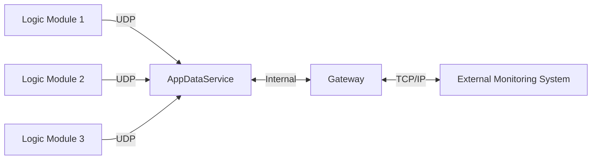
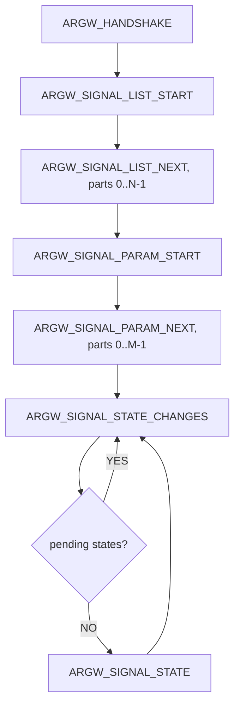

# Radiy Gateway Protocol Specification

**Document Version:**  0.1  
**Protocol Version:** 1.0  
**Date:** 12/2025  
**Authors:** Radiy Technical Team  
**Status:** Draft

---

## 1. Introduction

### 1.1 Purpose
This document specifies the communication protocol between Radiy's Gateway software and external monitoring systems.

**Protocol Version Scope:** This document describes **Protocol Version 1.0**.

### 1.2 Scope
The protocol defines the message structure, request/response patterns, and data exchange mechanisms for signal monitoring and state management in industrial automation environments.

### 1.3 System Overview



The Gateway acts as a bridge between Radiy's equipment and external monitoring systems, providing:
- Signal parameter retrieval
- Signal state monitoring
- State change retrieval
- Redundant data source management

---

## 2. Connection Specification

### 2.1 Transport Protocol
- **Protocol:** TCP/IP
- **Default Port:** 5566 (configurable)
- **Connection Model:** Server/Client
  - **Server:** Radiy Gateway
  - **Client:** External Monitoring System
- **Connection Mode:** Persistent connection with keep-alive
- **Maximum payload size:** 2 MB

**Data Integrity:**
TCP provides built-in transport-level data integrity and reliability. Additionally, this protocol implements application-level CRC32 checksums (Section 3.4) for end-to-end message integrity verification.

### 2.2 Connection Establishment
1. Client initiates TCP connection to Gateway on configured port
2. Client sends `ARGW_HANDSHAKE` request
3. Gateway validates and responds with handshake acknowledgment
4. Connection is established and ready for data exchange

### 2.3 Connection Management
- Client is responsible for maintaining connection
- Heartbeat/keep-alive mechanism recommended
- Automatic reconnection on connection loss should be implemented by client

---

## 3. Message Structure

### 3.1 General Message Format
All messages (requests and responses) follow this binary structure:

```
+------------------+------------------+------------------+------------------+------------------+
| Request ID       | Payload Size     | Status Code      | Payload          | CRC32            |
| (4 bytes)        | (4 bytes)        | (4 bytes)        | (variable)       | (4 bytes)        |
+------------------+------------------+------------------+------------------+------------------+
```

**Protocol Version Handling:**
- Server implements a **single fixed protocol version** (see document header)
- Protocol version is verified during the `ARGW_HANDSHAKE` exchange (Section 6.1)
- Client and server must use **identical protocol versions** - no negotiation or compatibility layer
- Version mismatch during handshake results in connection rejection

**Request/Response Flow:**
- Client sends a request with a specific Request ID, Status Code = 0, and request-specific payload
- Server responds with the **same Request ID**, Status Code indicating success or error, and response-specific payload
- Status Code = 0 indicates success; non-zero values indicate errors (see Section 8.2)
- Client examines Status Code to determine if payload is present

### 3.2 Field Descriptions

| Field | Size | Type | Description |
|-------|------|------|-------------|
| Request ID | 4 bytes | uint32 | Identifies the request/response type |
| Payload Size | 4 bytes | uint32 | Size of the payload in bytes (0 for errors, excluding header and CRC) |
| Status Code | 4 bytes | uint32 | 0 = success, non-zero = error code (see Section 8.2) |
| Payload | Variable | Binary | Request/response specific data (present only when Status Code = 0) |
| CRC32 | 4 bytes | uint32 | CRC32 checksum of entire message (excluding CRC field itself) |

**Payload Interpretation:**
- **Requests:** Payload contains request-specific data (see Section 6)
- **Success Responses (Status Code = 0):** Payload contains operation-specific success data (see Section 6)
- **Error Responses (Status Code ≠ 0):** Payload is not present

### 3.3 Byte Order
- **Endianness:** Little-endian (all multi-byte fields)
- **Floating-point format:** IEEE 754

### 3.4 CRC32 Calculation
- **Algorithm:** CRC-32 (IEEE 802.3 polynomial: 0x04C11DB7)
- **Calculation Range:** From Request ID through end of Payload
- **Initial Value:** 0xFFFFFFFF
- **Final XOR:** 0xFFFFFFFF

### 3.5 Error Response Structure
When Status Code is non-zero (error condition):
- **Payload Size = 0** (no payload data)
- **Error code** is indicated only by the Status Code field value (see Section 8.2)
- No additional error message or data is transmitted

**Special Cases:**
- **Unknown Request ID:** Server responds with the unknown Request ID and Status Code = `INVALID_REQUEST` (1)
- **CRC Failure:** Server may respond with Request ID 0x0000 and Status Code = `CRC_ERROR` (10), or close the connection

---

## 4. Request IDs and Operations

### 4.1 Request ID List

| Request ID | Value (hex) | Description | Direction |
|------------|-------------|-------------|-----------|
| ARGW_HANDSHAKE | 0x0001 | Initial handshake | Client -> Server |
| ARGW_SIGNAL_LIST_START | 0x0100 | Start retrieving list of AppSignalIDs | Client -> Server |
| ARGW_SIGNAL_LIST_NEXT | 0x0101 | Continue retrieving list of AppSignalIDs | Client -> Server |
| ARGW_SIGNAL_PARAM_START | 0x0200 | Start retrieving signal parameters | Client -> Server |
| ARGW_SIGNAL_PARAM_NEXT | 0x0201 | Continue retrieving signal parameters | Client -> Server |
| ARGW_SIGNAL_STATE | 0x0300 | Request signal states | Client -> Server |
| ARGW_SIGNAL_STATE_CHANGES | 0x0301 | Request signal state changes | Client -> Server |

### 4.2 Response Convention
- Response uses the same Request ID as the corresponding request
- **Status Code field indicates success (0) or error (non-zero)**
- Status Code = 0: Payload contains operation-specific success data (see Section 6)
- Status Code ≠ 0: No payload, Payload Size = 0 (see Section 8.2 for error codes)

---

## 5. Signal Identification

### 5.1 AppSignalID
- **Type:** C-style null-terminated string (ASCII encoding)
- **Character Set:** Limited to ASCII characters: `#`, `A-Z`, `a-z`, `0-9`, `_` (underscore), `.` (dot)
- **Format:** Must always start with `#` character
- **Maximum Length:** 64 bytes including null terminator (63 usable characters + `\0`)
- **Uniqueness:** Unique within the system
- **Special Characters:**
  - **`#`** - Mandatory prefix for all AppSignalIDs
  - **`.` (dot)** - Special separator used in generated signals from the Bus signal (e.g., `#BUSSIGNALID.subsignal`)
  - **`_` (underscore)** - General-purpose separator

### 5.2 AppSignalID Hash
- **Algorithm:** Custom hash algorithm (see implementation below)
- **HashType:** uint64 (64-bit unsigned integer)
- **Hash Input:** The entire AppSignalID string including the leading `#` but excluding the null terminator
- **Uniqueness Guarantee:** The system ensures uniqueness by validating the set of AppSignalIDs during configuration to detect and prevent hash collisions.

**Hash Calculation Reference Implementation:**

```cpp
#include <cstdint>
#include <string_view>

using Hash = uint64_t;

inline constexpr Hash UNDEFINED_HASH = 0x0000000000000000ULL;

/**
 * Calculate hash for AppSignalID
 *
 * @param str - String view of AppSignalID (must start with '#', ASCII characters only)
 * @param init - Initial hash value (default: 0)
 * @return Hash - 64-bit hash value
 * 
 * Example:
 *   std::string_view signalId = "#APPSIGNALID_1SF";
 *   Hash hash = calcHash(signalId);
 */
[[nodiscard]] constexpr Hash calcHash(std::string_view str, Hash init = 0ULL)
{
    Hash hash = init;

    for (char c : str)
    {
        uint16_t unicode = static_cast<unsigned char>(c);
        hash += (hash << 5) + unicode;
    }

    return hash;
}
```

---

## 6. Request/Response Specifications

**AppDataService Connection Dependency:**
- All requests **except** `ARGW_HANDSHAKE` require the Gateway to be connected to AppDataService.
- If the Gateway is not connected to AppDataService, the server may respond with Status Code = `NO_ADS_CONNECTION` (3) and no payload.

### 6.1 ARGW_HANDSHAKE

#### Purpose
Initial connection handshake to establish protocol version and capabilities.

**Protocol Version Negotiation:**
- Server implements a **single fixed protocol version** (no multi-version support)
- Client specifies the protocol version it supports in the request
- Server compares client version with its own implemented version:
  - **Match:** Server responds with Status Code = 0 and handshake succeeds
  - **Mismatch:** Server responds with Status Code = `UNSUPPORTED_VERSION` (2) and connection should be closed
- **No version negotiation or downgrading** - client and server must use identical protocol versions
- Server and client are **incompatible** if protocol versions differ

#### Request Payload
```
struct GwHandshakeRequest {
    uint16_t protocolVersion;  // Protocol version client supports (e.g., 0x0100 for v1.0)
    char clientName[64];       // Null-terminated client name
};

static_assert(sizeof(GwHandshakeRequest) == 66);
```

| Offset | Size | Type | Field |
|--------|------|------|-------|
| 0 | 2 | `uint16_t` | `protocolVersion` |
| 2 | 64 | `char[64]` | `clientName` |

Total size: 66 bytes

**Protocol Version Format:** 0xMMmm where MM = major version, mm = minor version
- Example: 0x0100 = Version 1.0 (current)
- Example: 0x0101 = Version 1.1
- Example: 0x0200 = Version 2.0

#### Response Payload (Success: Status Code = 0)
```
struct GwHandshakeResponse {
    uint16_t protocolVersion;          // Server protocol version (must match request for success)
    uint16_t reserved;                 // Reserved (must be 0)

    uint32_t maxStateRequest;          // Max signal states per request (ARGW_SIGNAL_STATE)

    // Structure size compatibility fields (bytes)
    uint32_t sizeof_GwAppSignalParam;  // See Section 7.1
    uint32_t sizeof_GwAppSignalState;  // See Section 7.2
};

static_assert(sizeof(GwHandshakeResponse) == 16);
```

| Offset | Size | Type | Field |
|--------|------|------|-------|
| 0 | 2 | `uint16_t` | `protocolVersion` |
| 2 | 2 | `uint16_t` | `reserved` |
| 4 | 4 | `uint32_t` | `maxStateRequest` |
| 8 | 4 | `uint32_t` | `sizeof_GwAppSignalParam` |
| 12 | 4 | `uint32_t` | `sizeof_GwAppSignalState` |

Total size: 16 bytes

**Expected Size Field Values (Protocol v1.0):**

| Field | Expected value (bytes) | Notes |
|------|-------------------------|-------|
| `sizeof_GwAppSignalParam` | 896 | See Section 7.1 |
| `sizeof_GwAppSignalState` | 48 | See Section 7.2 |

**Compatibility Check (Client):**
- Client can compare `sizeof_GwAppSignalParam` and `sizeof_GwAppSignalState` against its locally compiled `sizeof(GwAppSignalParam)` and `sizeof(GwAppSignalState)`.
- A mismatch indicates protocol incompatibility (likely packing/alignment or definition mismatch) and the client should reject the connection.
- If client version == server version: Status Code = 0, handshake response with matching version
- If client version ≠ server version: Status Code = 2 (`UNSUPPORTED_VERSION`), no payload

---

### 6.2 ARGW_SIGNAL_LIST_START / ARGW_SIGNAL_LIST_NEXT

#### Purpose
Retrieve complete list of all AppSignalIDs (Application Signal Identifiers) available in the system. Uses pagination for large signal sets.

#### Request Payload (ARGW_SIGNAL_LIST_START)
```
struct GwSignalListStartRequest {
    uint32_t reserved;
};

static_assert(sizeof(GwSignalListStartRequest) == 4);
```

| Offset | Size | Type | Field |
|--------|------|------|-------|
| 0 | 4 | `uint32_t` | `reserved` |

Total size: 4 bytes

#### Response Payload (ARGW_SIGNAL_LIST_START)
```
struct GwSignalListStartResponse {
    uint32_t totalItemCount;    // Total number of AppSignalIDs in system
    uint32_t partCount;         // Total number of parts (pages) to retrieve
    uint32_t itemsPerPart;      // Maximum number of AppSignalIDs per part
};

static_assert(sizeof(GwSignalListStartResponse) == 12);
```

| Offset | Size | Type | Field |
|--------|------|------|-------|
| 0 | 4 | `uint32_t` | `totalItemCount` |
| 4 | 4 | `uint32_t` | `partCount` |
| 8 | 4 | `uint32_t` | `itemsPerPart` |

Total size: 12 bytes

**Usage:**
- Client sends `ARGW_SIGNAL_LIST_START` to initiate list retrieval
- Server responds with pagination information (total count, number of parts, items per part)
- Client then uses `ARGW_SIGNAL_LIST_NEXT` to retrieve each part sequentially

---

#### Request Payload (ARGW_SIGNAL_LIST_NEXT)
```
struct GwSignalListNextRequest {
    uint32_t part;              // Part number to retrieve (0-based index)
};

static_assert(sizeof(GwSignalListNextRequest) == 4);
```

| Offset | Size | Type | Field |
|--------|------|------|-------|
| 0 | 4 | `uint32_t` | `part` |

Total size: 4 bytes

**Part Number:**
- Valid range: 0 to (partCount - 1)
- Client should retrieve parts sequentially: part=0, part=1, ..., part=(partCount-1)

#### Response Payload (ARGW_SIGNAL_LIST_NEXT)
```
struct GwSignalListNextResponse {
    uint32_t part;              // Part number of this response
    uint32_t appSignalIdCount;  // Number of AppSignalIDs in this response
    
    // Array of AppSignalID strings
    struct {
        char appSignalId[64];  // AppSignalID (null-terminated, max 64 bytes including '\0')
    } appSignalIds[appSignalIdCount];
};
```

| Offset | Size | Type | Field |
|--------|------|------|-------|
| 0 | 4 | `uint32_t` | `part` |
| 4 | 4 | `uint32_t` | `appSignalIdCount` |
| 8 | `appSignalIdCount * 64` | `char[64]` | `appSignalIds[]` |

Total size: `8 + (appSignalIdCount * 64)` bytes

**Response Behavior:**
- Server returns the requested part number along with the AppSignalIDs for that part
- Each AppSignalID is a C-style null-terminated string with fixed 64-byte size (as defined in Section 5.1)
- Last part may contain fewer items than `itemsPerPart` if total count is not evenly divisible

**Example Flow:**
```
Client -> Server: ARGW_SIGNAL_LIST_START ()
Server -> Client: ARGW_SIGNAL_LIST_START (totalItemCount=1250, partCount=3, itemsPerPart=500)

Client -> Server: ARGW_SIGNAL_LIST_NEXT (part=0)
Server -> Client: ARGW_SIGNAL_LIST_NEXT (part=0, 500 AppSignalIDs)

Client -> Server: ARGW_SIGNAL_LIST_NEXT (part=1)
Server -> Client: ARGW_SIGNAL_LIST_NEXT (part=1, 500 AppSignalIDs)

Client -> Server: ARGW_SIGNAL_LIST_NEXT (part=2)
Server -> Client: ARGW_SIGNAL_LIST_NEXT (part=2, 250 AppSignalIDs)
```

---

### 6.3 ARGW_SIGNAL_PARAM_START / ARGW_SIGNAL_PARAM_NEXT

#### Purpose
Retrieve detailed descriptions and parameters for all signals. Uses pagination similar to signal list retrieval.

For the complete `GwAppSignalParam` structure definition, see **Section 7.1**.

---

#### Request Payload (ARGW_SIGNAL_PARAM_START)
```
struct GwSignalParamStartRequest {
    uint32_t reserved;
};

static_assert(sizeof(GwSignalParamStartRequest) == 4);
```

| Offset | Size | Type | Field |
|--------|------|------|-------|
| 0 | 4 | `uint32_t` | `reserved` |

Total size: 4 bytes

#### Response Payload (ARGW_SIGNAL_PARAM_START)
```
struct GwSignalParamStartResponse {
    uint32_t totalItemCount;    // Total number of GwAppSignalParams in system
    uint32_t partCount;         // Total number of parts (pages) to retrieve
    uint32_t itemsPerPart;      // Maximum number of GwAppSignalParams per part
};

static_assert(sizeof(GwSignalParamStartResponse) == 12);
```

| Offset | Size | Type | Field |
|--------|------|------|-------|
| 0 | 4 | `uint32_t` | `totalItemCount` |
| 4 | 4 | `uint32_t` | `partCount` |
| 8 | 4 | `uint32_t` | `itemsPerPart` |

Total size: 12 bytes

**Usage:**
- Client sends `ARGW_SIGNAL_PARAM_START` to initiate parameter retrieval
- Server responds with pagination information (total count, number of parts, items per part)
- Client then uses `ARGW_SIGNAL_PARAM_NEXT` to retrieve each part sequentially

---

#### Request Payload (ARGW_SIGNAL_PARAM_NEXT)
```
struct GwSignalParamNextRequest {
    uint32_t part;              // Part number to retrieve (0-based index)
};

static_assert(sizeof(GwSignalParamNextRequest) == 4);
```

| Offset | Size | Type | Field |
|--------|------|------|-------|
| 0 | 4 | `uint32_t` | `part` |

Total size: 4 bytes

**Part Number:**
- Valid range: 0 to (partCount - 1)
- Client should retrieve parts sequentially: part=0, part=1, ..., part=(partCount-1)

#### Response Payload (ARGW_SIGNAL_PARAM_NEXT)
```
struct GwSignalParamNextResponse {
    uint32_t part;              // Part number of this response
    uint32_t paramCount;        // Number of GwAppSignalParams in this response
    
    // Array of GwAppSignalParam structures
    GwAppSignalParam params[paramCount];
};
```

| Offset | Size | Type | Field |
|--------|------|------|-------|
| 0 | 4 | `uint32_t` | `part` |
| 4 | 4 | `uint32_t` | `paramCount` |
| 8 | `paramCount * sizeof(GwAppSignalParam)` | `GwAppSignalParam` | `params[]` |

Total size: `8 + (paramCount * sizeof(GwAppSignalParam))` bytes

**Response Behavior:**
- Server returns the requested part number along with the GwAppSignalParams for that part
- Each GwAppSignalParam follows the structure defined above
- Last part may contain fewer items than `itemsPerPart` if total count is not evenly divisible

**Example Flow:**
```
Client -> Server: ARGW_SIGNAL_PARAM_START ()
Server -> Client: ARGW_SIGNAL_PARAM_START (totalItemCount=1200, partCount=3, itemsPerPart=500)

Client -> Server: ARGW_SIGNAL_PARAM_NEXT (part=0)
Server -> Client: ARGW_SIGNAL_PARAM_NEXT (part=0, 500 GwAppSignalParams)

Client -> Server: ARGW_SIGNAL_PARAM_NEXT (part=1)
Server -> Client: ARGW_SIGNAL_PARAM_NEXT (part=1, 500 GwAppSignalParams)

Client -> Server: ARGW_SIGNAL_PARAM_NEXT (part=2)
Server -> Client: ARGW_SIGNAL_PARAM_NEXT (part=2, 200 GwAppSignalParams)
```

---

### 6.4 ARGW_SIGNAL_STATE

#### Purpose
Request current states of specific signals by their hashes.

For the complete `GwAppSignalState` structure definition, see **Section 7.2**.

---

#### Request Payload
```
struct GwSignalStateRequest {
    uint32_t  signalCount;               // Number of signals requested
    uint64_t signalHashes[signalCount]; // Array of signal hashes
};
```

| Offset | Size | Type | Field |
|--------|------|------|-------|
| 0 | 4 | `uint32_t` | `signalCount` |
| 4 | `signalCount * 8` | `uint64_t` | `signalHashes[]` |

Total size: `4 + (signalCount * 8)` bytes

**Request Behavior:**
- Client specifies an array of signal hashes to request
- **Maximum number of signals per request**: The `signalCount` must not exceed the `maxStateRequest` value received in the `GwHandshakeResponse` (Section 6.1). Requests exceeding this limit will result in error code `TOO_MANY_SIGNALS` (4).
- **Missing signals**: If a requested signal hash is not found in the system, no error is reported. The signal is simply skipped in the response.

#### Response Payload
```
struct GwSignalStateResponse {
    uint32_t stateCount;        // Number of states returned
    
    // Array of GwAppSignalState structures
    GwAppSignalState states[stateCount];
};
```

| Offset | Size | Type | Field |
|--------|------|------|-------|
| 0 | 4 | `uint32_t` | `stateCount` |
| 4 | `stateCount * sizeof(GwAppSignalState)` | `GwAppSignalState` | `states[]` |

Total size: `4 + (stateCount * sizeof(GwAppSignalState))` bytes

**Response Behavior:**
- Server returns states for all **found** signals
- **`stateCount` may be less than requested `signalCount`** if some signal hashes are not found
- States are returned in the same order as requested hashes (for found signals only)
- If none of the requested signals are found, `stateCount` will be 0 (empty response, but Status Code = 0)

**Example Flow:**
```
// All signals found
Client -> Server: ARGW_SIGNAL_STATE (signalCount=3, hashes=[0x123, 0x456, 0x789])
Server -> Client: ARGW_SIGNAL_STATE (Status=0, stateCount=3, states=[...])

// One signal not found (0x999 doesn't exist)
Client -> Server: ARGW_SIGNAL_STATE (signalCount=3, hashes=[0x123, 0x456, 0x999])
Server -> Client: ARGW_SIGNAL_STATE (Status=0, stateCount=2, states=[0x123, 0x456])

// No signals found
Client -> Server: ARGW_SIGNAL_STATE (signalCount=2, hashes=[0x999, 0x888])
Server -> Client: ARGW_SIGNAL_STATE (Status=0, stateCount=0)
```

---

### 6.5 ARGW_SIGNAL_STATE_CHANGES

#### Purpose
Fetch accumulated signal state changes from the server's queue for the client connection.

**Change Detection:**
A signal is considered "changed" when:
- Any flag bit changes (validity, limits, simulation, etc.)
- Value changes by the configured aperture
- Periodic records are generated based on AppDataService configuration

**Queue Behavior:**
- Server maintains a separate state change queue for each client connection
- This request fetches and returns accumulated changes from the client's queue
 - Queue size is limited; older changes may be dropped if client doesn't poll frequently enough

---

#### Request Payload
```
struct GwSignalStateChangesRequest {
    uint32_t reserved;
};

static_assert(sizeof(GwSignalStateChangesRequest) == 4);
```

| Offset | Size | Type | Field |
|--------|------|------|-------|
| 0 | 4 | `uint32_t` | `reserved` |

Total size: 4 bytes

**Request Behavior:**
- Client sends request to retrieve accumulated state changes
- Server returns pending changes from the client's dedicated queue

---

#### Response Payload
```
struct GwSignalStateChangesResponse {
    uint32_t pendingStatesCount; // Number of state changes still in queue (not returned in this response)
    uint32_t stateCount;         // Number of states in this response
    
    // Array of GwAppSignalState structures
    GwAppSignalState states[stateCount];
};
```

| Offset | Size | Type | Field |
|--------|------|------|-------|
| 0 | 4 | `uint32_t` | `pendingStatesCount` |
| 4 | 4 | `uint32_t` | `stateCount` |
| 8 | `stateCount * sizeof(GwAppSignalState)` | `GwAppSignalState` | `states[]` |

Total size: `8 + (stateCount * sizeof(GwAppSignalState))` bytes

**Response Behavior:**
- **`pendingStatesCount`**: Indicates how many additional state changes remain in the queue after this response
  - If >= `GwHandshakeResponse.maxStateRequest`: Client should immediately request again to retrieve remaining changes
- **`stateCount`**: Number of state changes included in this response
- **`states`**: Array of changed signal states, each following the `GwAppSignalState` structure (Section 6.4)
- States are returned in chronological order (oldest changes first)

**Recommended Polling Strategy:**
- Poll at regular intervals (20ms - 200ms depending on application requirements)
- If `pendingStatesCount >= GwHandshakeResponse.maxStateRequest`, request again immediately without waiting
- Continue requesting until `pendingStatesCount < GwHandshakeResponse.maxStateRequest`
- Adjust polling rate based on system load and change frequency

---

## 7. Data Structures

### 7.1 GwAppSignalParam Structure

The `GwAppSignalParam` structure contains detailed parameters and metadata for each signal.

```cpp
struct GwAppSignalParam {
    uint64_t hash;                // Signal hash (as defined in Section 5.2)
    char     appSignalId[64];     // AppSignalID (ASCII, null-terminated, as defined in Section 5.1)
    char     customSignalId[64];  // Custom Signal ID (UTF-8, null-terminated)

    char     caption[256];        // Signal caption/description (UTF-8, null-terminated)
    char     equipmentId[64];     // EquipmentID (ASCII, null-terminated)
    char     lmEquipmentId[64];   // LogicModule EquipmentID (ASCII, null-terminated)
    char     units[64];           // Engineering units (UTF-8, null-terminated)
    char     tags[256];           // Tags, space-separated (ASCII, null-terminated)

    uint8_t  channel;             // Channel code (see Section 7.3)
    uint8_t  inOutType;           // I/O type code (see Section 7.4)
    uint8_t  type;                // Signal type code (see Section 7.5)
    uint8_t  decimalPlaces;       // Number of decimal places for analog signals

    double   lowValidRange;       // Low valid range for analog signals
    double   highValidRange;      // High valid range for analog signals

    uint8_t  tuning;              // Tuning flag (0 = non-tunable, 1 = tunable)
    double   tuningDefaultValue;  // Default tuning value
    double   tuningLowBound;      // Low bound for tuning value
    double   tuningHighBound;     // High bound for tuning value
};

static_assert(sizeof(GwAppSignalParam) == 896);
```

| Offset | Size | Type | Field |
|--------|------|------|-------|
| 0 | 8 | `uint64_t` | `hash` |
| 8 | 64 | `char[64]` | `appSignalId` |
| 72 | 64 | `char[64]` | `customSignalId` |
| 136 | 256 | `char[256]` | `caption` |
| 392 | 64 | `char[64]` | `equipmentId` |
| 456 | 64 | `char[64]` | `lmEquipmentId` |
| 520 | 64 | `char[64]` | `units` |
| 584 | 256 | `char[256]` | `tags` |
| 840 | 1 | `uint8_t` | `channel` |
| 841 | 1 | `uint8_t` | `inOutType` |
| 842 | 1 | `uint8_t` | `type` |
| 843 | 1 | `uint8_t` | `decimalPlaces` |
| 844 | 4 | Padding | (alignment) |
| 848 | 8 | `double` | `lowValidRange` |
| 856 | 8 | `double` | `highValidRange` |
| 864 | 1 | `uint8_t` | `tuning` |
| 865 | 7 | Padding | (alignment) |
| 872 | 8 | `double` | `tuningDefaultValue` |
| 880 | 8 | `double` | `tuningLowBound` |
| 888 | 8 | `double` | `tuningHighBound` |

Total size: 896 bytes

**String Field Encoding:**
- **ASCII (7-bit) fields:** `appSignalId`, `equipmentId`, `lmEquipmentId`, `tags`
- **UTF-8 fields:** `customSignalId`, `caption`, `units`
- All strings are null-terminated C-style strings with fixed maximum lengths as shown above

---

### 7.2 GwAppSignalState Structure

The `GwAppSignalState` structure contains the current state and value of a signal.

```cpp
struct GwAppSignalState {
    uint64_t hash;                    // Signal hash (as defined in Section 5.2)
    int64_t  systemTime;              // Server system time (UTC+0) when the state was acquired ()
    int64_t  localTime;               // systemTime adjusted to Local time zone
    int64_t  plantTime;               // Timestamp assigned in LogicModule (local time zone)
    double   value;                   // Signal value (for discrete: 0=false, 1=true)
    uint32_t flags;                   // State flags (see Section 7.3 for bit definitions)
    uint32_t reserved;                // Reserved for future use
};

static_assert(sizeof(GwAppSignalState) == 48);
```
| Offset | Size | Type | Field |
|--------|------|------|-------|
| 0 | 8 | `uint64_t` | `hash` |
| 8 | 8 | `int64_t` | `systemTime` |
| 16 | 8 | `int64_t` | `localTime` |
| 24 | 8 | `int64_t` | `plantTime` |
| 32 | 8 | `double` | `value` |
| 40 | 4 | `uint32_t` | `flags` |
| 44 | 4 | `uint32_t` | `reserved` |

Total size: 48 bytes

All timestamps representing milliseconds since Unix epoch (1970-01-01 00:00:00 UTC).

**Value Field:**
- For **analog signals**: Contains the actual measured/calculated value
- For **discrete signals**: 0 = false/off, 1 = true/on
- For **bus signals**: Bus signals themselves do not have state values. During project compilation, bus signals are decomposed into subsignals (e.g., `#BUSSIGNAL` becomes `#BUSSIGNAL.subsignal1`, `#BUSSIGNAL.subsignal2`, etc.). State requests should be made for the individual subsignals, not the parent bus signal.

**Signal State Flags:**

| Bit | Name | Description |
|-----|------|-------------|
| 0 | VALID | Signal value is valid and reliable. Set according to validity signal; if validity signal doesn't exist, equals stateAvailable |
| 1 | STATE_AVAILABLE | Application data received from Logic Module. 1 = data available, 0 = no data from LM |
| 2 | SIMULATED | Signal is simulated (AFB sim_lock applied) |
| 3 | BLOCKED | Signal is blocked (AFB sim_lock applied) |
| 4 | MISMATCH | Signal mismatch detected (AFB mismatch) |
| 5 | ABOVE_HIGH_LIMIT | Signal value is above high engineering units limit |
| 6 | BELOW_LOW_LIMIT | Signal value is below low engineering units limit |
| 7 | SW_SIMULATED | Signal state acquired from software simulated packet |
| 8 | TUNING_DEFAULT | Tunable signal value equals tuning default value (always 0 for non-tunable signals) |
| 9-15 | Reserved | Reserved for future state flags |
| 16-31 | Internal Use Only | Reserved for internal system use (archiving, trending). Clients should ignore these bits. |

### 7.3 Channel Codes
| Code | Name | Description |
|------|------|-------------|
| 0 | Channel A | Represents channel A |
| 1 | Channel B | Represents channel B |
| 2 | Channel C | Represents channel C |
| 3 | Channel D | Represents channel D |

### 7.4 Signal I/O Type Codes
| Code | Name | Description |
|------|------|-------------|
| 0 | Input | Input signal type |
| 1 | Output | Output signal type |
| 2 | Internal | Internal signal type |

### 7.5 Signal Type Codes
| Code | Name | Description |
|------|------|-------------|
| 0 | Analog | Analog signal type |
| 1 | Discrete | Discrete (binary/digital) signal type |
| 2 | Bus | Bus signal type |

---

## 8. Error Handling

### 8.1 Error Response Format
Error responses are identified by a non-zero Status Code in the message header (Section 3.2).

**Error Response Structure:**
- **Status Code ≠ 0:** Error condition
- **Payload Size = 0:** No payload data
- **Error identification:** Status Code value indicates the specific error (see Section 8.2)

**Processing errors:**
1. Client receives response with same Request ID as request
2. Client checks Status Code field
3. If Status Code = 0: Parse payload as successful response (Section 6)
4. If Status Code ≠ 0: No payload to parse, handle error based on Status Code value (Section 8.2)


### 8.2 Error Codes

| Code | Name | Description |
|------|------|-------------|
| 0 | SUCCESS | Operation successful |
| 1 | INVALID_REQUEST | Request format is invalid |
| 2 | UNSUPPORTED_VERSION | Protocol version not supported |
| 3 | NO_ADS_CONNECTION | Gateway not connected to AppDataService |
| 4 | TOO_MANY_SIGNALS | Request exceeds max signals limit |
| 7 | INTERNAL_ERROR | Internal server error |
| 10 | CRC_ERROR | CRC checksum verification failed |

---

## 9. Redundancy and Reliability

### 9.1 Data Source Redundancy
LogicModules provide two redundant communication channels connected to separate AppDataServices.

**Implementation Options:**
1. **Single Channel Mode:** Gateway uses one AppDataService, provides simplified operation
2. **Redundant Mode:** Gateway monitors both channels, implements failover logic

**Decision Required:** To be confirmed based on system requirements and reliability goals.

### 9.2 Connection Redundancy
- Client should support automatic reconnection on connection loss
- Gateway should handle multiple simultaneous client connections

---

## Appendices

### Appendix A: Example Message Flows

#### A.1 Initial Connection and Setup


**Usage Recommendation:**
- `ARGW_SIGNAL_STATE_CHANGES` is suitable for efficiently receiving only changed states and reducing bandwidth.
- However, it is **strongly recommended** to periodically refresh full signal states using `ARGW_SIGNAL_STATE` (e.g., every few seconds or minutes) to:
  - Resynchronize after potential missed changes (queue overflows, network issues).
  - Validate that client state remains consistent with the server.
  - Recover from any lost `ARGW_SIGNAL_STATE_CHANGES` requests or replies.

---

## Document Revision History

| Document Version | Date | Protocol Version | Author | Changes |
|------------------|------|------------------|--------|---------|
| 0.1 | 12/2025 | 1.0 (0x0100) | Radiy Technical Team | Initial draft |

