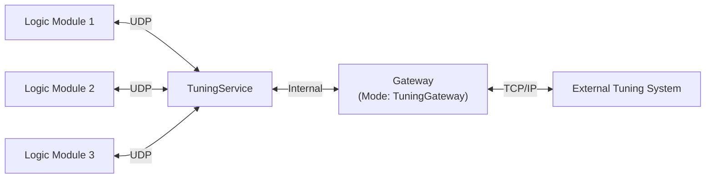
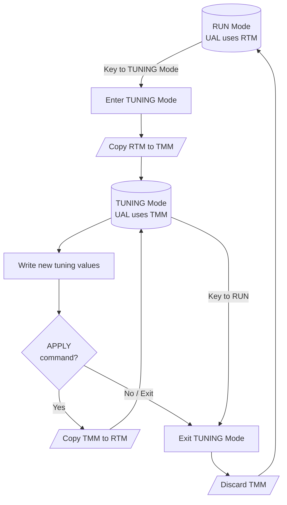
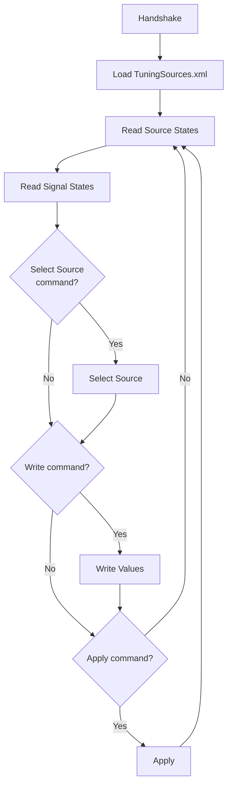

# Radiy TuningService Gateway Protocol Specification

**Document Version:** 0.1  
**Protocol Version:** 1.0  
**Date:** 18 Mar 2026  
**Authors:** Serhiy Malokhatko, Yuriy Beliy  
**Status:** Draft

## Table of Contents

- [1. Introduction](#1-introduction)
    - [1.1 Purpose](#11-purpose)
    - [1.2 Scope](#12-scope)
    - [1.3 System Overview](#13-system-overview)
    - [1.4 LogicModule Tuning Memory Model](#14-logicmodule-tuning-memory-model)
    - [1.5 Tuning Sources Configuration File (TuningSources.xml)](#15-tuning-sources-configuration-file-tuningsourcesxml)
    - [1.6 Single LM Control Mode (SingleLmControl)](#16-single-lm-control-mode-singlelmcontrol)
    - [1.7 Signal Identification](#17-signal-identification)
- [2. Connection Specification](#2-connection-specification)
    - [2.1 Transport Protocol](#21-transport-protocol)
    - [2.2 Connection Establishment](#22-connection-establishment)
    - [2.3 Connection Management](#23-connection-management)
- [3. Message Structure](#3-message-structure)
    - [3.1 General Message Format](#31-general-message-format)
    - [3.2 Field Descriptions](#32-field-descriptions)
    - [3.3 Byte Order](#33-byte-order)
    - [3.4 CRC32 Calculation](#34-crc32-calculation)
    - [3.5 Error Response Structure](#35-error-response-structure)
- [4. Request IDs and Operations](#4-request-ids-and-operations)
    - [4.1 Request ID List](#41-request-id-list)
    - [4.2 Response Convention](#42-response-convention)
- [5. Request/Response Specifications](#5-requestresponse-specifications)
    - [5.1 TGW_HANDSHAKE](#51-tgw_handshake)
    - [5.2 TGW_GET_TUNING_SOURCES_START / TGW_GET_TUNING_SOURCES_NEXT](#52-tgw_get_tuning_sources_start--tgw_get_tuning_sources_next)
    - [5.3 TGW_GET_TUNING_SOURCE_STATES](#53-tgw_get_tuning_source_states)
    - [5.4 TGW_TUNING_SIGNALS_READ](#54-tgw_tuning_signals_read)
    - [5.5 TGW_TUNING_SIGNALS_WRITE](#55-tgw_tuning_signals_write)
    - [5.6 TGW_TUNING_SIGNALS_APPLY](#56-tgw_tuning_signals_apply)
    - [5.7 TGW_CHANGE_CONTROLLED_TUNING_SOURCE](#57-tgw_change_controlled_tuning_source)
- [6. Data Structures](#6-data-structures)
    - [6.1 GwTuningSignalState Structure](#61-gwtuningsignalstate-structure)
- [7. Error Handling](#7-error-handling)
    - [7.1 Error Response Format](#71-error-response-format)
    - [7.2 Error Codes](#72-error-codes)
- [Appendices](#appendices)
    - [Appendix A: Example Message Flows](#appendix-a-example-message-flows)
    - [Appendix B: CRC32 Reference Implementation](#appendix-b-crc32-reference-implementation)
    - [Appendix C: TuningSources.xml File Format](#appendix-c-tuningsourcesxml-file-format)
- [Document Revision History](#document-revision-history)

---

<a id="1-introduction" name="1-introduction"></a>
## 1. Introduction

<a id="11-purpose" name="11-purpose"></a>
### 1.1 Purpose
This document specifies the communication protocol between Radiy's Gateway software operating in TuningGateway (TuningService gateway) mode and external tuning systems.

**Protocol Version Scope:** This document describes **Protocol Version 1.0**.

<a id="12-scope" name="12-scope"></a>
### 1.2 Scope
The protocol defines the message structure, request/response patterns, and data exchange mechanisms for tunable signal monitoring and state management in industrial automation environments.

<a id="13-system-overview" name="13-system-overview"></a>
### 1.3 System Overview



> **Note:** In this document, when we refer to `TuningGateway` or `Gateway`, we mean the `Gateway` program configured to work in mode `TuningGateway`.

The Gateway acts as a bridge between Radiy's equipment and external tuning systems, providing:
- Tuning sources discovery and state monitoring (availability / active source)
- Tunable signal parameters retrieval
- Tunable signal states read
- Tunable signal value write and apply (commit)
- Controlled tuning source management (take/release control)

For general tuning concepts and user-level operations, see **D11.9 - FSC Tuning User Manual**.

<a id="14-logicmodule-tuning-memory-model" name="14-logicmodule-tuning-memory-model"></a>
### 1.4 LogicModule Tuning Memory Model

The LogicModule (LM) maintains two separate tuning memory areas for tunable signal values:

| Memory Area | Also Known As | Used When |
|-------------|---------------|-----------|
| Runtime Tuning Memory (RTM) | Run Mode Tuning Values (RMTV) | LM is in RUN mode |
| Tuning Mode Memory (TMM) | Tuning Mode Tuning Values (TMTV) | LM is in TUNING mode |

> **Note:** The User Application Logic (UAL) uses tunable signal values from the active memory area based on the current operating mode.

#### Tuning Mode Operation

When the LM enters TUNING mode:
1. All values from **Runtime Tuning Memory** are copied to **Tuning Mode Memory**
2. The UAL now operates using values from **Tuning Mode Memory**
3. User writes new tuning values — these are written to **Tuning Mode Memory**
4. User sends the **APPLY** command — all values from **Tuning Mode Memory** are copied to **Runtime Tuning Memory**
5. User can write and apply additional parameters as needed

**Important:** Once values are applied (APPLY command), there is no way to discard these changes by exiting TUNING mode (removing the key) — only setting new values is possible.

> **Note (Persistence):** Applied tuning values are stored in volatile memory. After LM power-off / restart, tuning values are restored from EEPROM (RPCT-configured default values).

#### Exiting Tuning Mode

When the LM exits TUNING mode (returns to RUN mode):
- The LM switches back to using values from **Runtime Tuning Memory**
- The UAL continues operating with these values

**Warning:** If tuning values were written but not applied (no APPLY command sent), these unapplied values in **Tuning Mode Memory** will be discarded when exiting TUNING mode. The LM will resume using the previous **Runtime Tuning Memory** values.



<a id="15-tuning-sources-configuration-file-tuningsourcesxml" name="15-tuning-sources-configuration-file-tuningsourcesxml"></a>
### 1.5 Tuning Sources Configuration File (TuningSources.xml)

For each TuningService, the **RPCT build output** contains a `TuningSources.xml` file.

Typical location in build output is a per-service directory named by the TuningService EquipmentID, for example: `./SDS_SPC1_WS_TUNS/TuningSources.xml`.

**Obtaining the file:**
- Via protocol: Use the `TGW_GET_TUNING_SOURCES_START` / `TGW_GET_TUNING_SOURCES_NEXT` requests ([Section 5.2](#52-tgw_get_tuning_sources_start--tgw_get_tuning_sources_next)) to retrieve the file contents from the Gateway in parts
- From build output: Load the file directly from the RPCT build output directory

Before starting work, an external client should read and parse this file to obtain the configuration and identifiers required for correct protocol usage.

> **Note:** The XML may contain multiple `DataSource` entries for the same equipment with different `Profile` values (used mainly to adjust connection/settings in simulated environments). External clients should use the `DataSource` entry with `Profile="Default"`.

This file contains (at minimum):
- The list of available tuning sources (equipment/modules) and their identifiers
- Tuning network parameters (e.g., tuning IP/port and related service parameters)
- The list of tunable signals (AppSignalIDs) associated with each tuning source

For a format overview, see [Appendix C: TuningSources.xml File Format](#appendix-c-tuningsourcesxml-file-format).

For a typical client initialization sequence and working loop based on this file, see [Appendix A: Example Message Flows](#appendix-a-example-message-flows).


<a id="16-single-lm-control-mode-singlelmcontrol" name="16-single-lm-control-mode-singlelmcontrol"></a>
### 1.6 Single LM Control Mode (SingleLmControl)

`SingleLmControl` is a TuningService configuration option that controls how tuning source (LogicModule) control is granted to tuning clients.

For safety-oriented systems, `SingleLmControl` should be enabled (`true`) so that the client must explicitly select a single tuning source before issuing write/apply commands.

**When `SingleLmControl = true`:**
- Only one tuning client is considered active at a time.
- Before sending `TGW_TUNING_SIGNALS_WRITE` or `TGW_TUNING_SIGNALS_APPLY`, the client must select a tuning source and activate its control using `TGW_CHANGE_CONTROLLED_TUNING_SOURCE` ([Section 5.7](#57-tgw_change_controlled_tuning_source)).
- The selected tuning source can be verified via `TGW_GET_TUNING_SOURCE_STATES` by checking `GwTuningSourceState.controlIsActive`.

**When `SingleLmControl = false` (typical for non-safety systems):**
- Control is enabled for all tuning sources, so the client can write/apply to any accessible tuning source without selecting one.
- `TGW_CHANGE_CONTROLLED_TUNING_SOURCE` is not applicable and will respond with Status Code = `GWC_SINGLE_LM_CONTROL_DISABLED`.


<a id="17-signal-identification" name="17-signal-identification"></a>
### 1.7 Signal Identification

#### 1.7.1 AppSignalID
- **Type:** C-style null-terminated string (ASCII encoding)
- **Character Set:** Limited to ASCII characters: `#`, `A-Z`, `a-z`, `0-9`, `_` (underscore), `.` (dot)
- **Format:** Must always start with `#` character
- **Maximum Length:** 128 bytes including null terminator (127 usable characters + `\0`)
- **Uniqueness:** Unique within the system
- **Special Characters:**
    - **`#`** - Mandatory prefix for all AppSignalIDs
    - **`.` (dot)** - Special separator used in generated signals from the Bus signal (e.g., `#BUSSIGNALID.subsignal`)
    - **`_` (underscore)** - General-purpose separator

<a id="172-appsignalid-hash" name="172-appsignalid-hash"></a>
#### 1.7.2 AppSignalID Hash
- **Algorithm:** Custom hash algorithm (see implementation below)
- **HashType:** uint64 (64-bit unsigned integer)
- **Hash Input:** The entire AppSignalID string including the leading `#` but excluding the null terminator
- **Uniqueness Guarantee:** The system ensures uniqueness by validating the set of AppSignalIDs during configuration to detect and prevent hash collisions.

**Hash Calculation Reference Implementation:**

```cpp
#pragma once

#include <cstdint>
#include <string_view>

using Hash = uint64_t;

inline constexpr Hash UNDEFINED_HASH = 0x0000000000000000ULL;

/**
 * Calculate hash for AppSignalID
 *
 * @param str - String view of AppSignalID (must start with '#', ASCII characters only)
 * @param init - Initial hash value (default: 0)
 * @return Hash - 64-bit hash value
 * 
 * Example:
 *   std::string_view signalId = "#APPSIGNALID_1SF";
 *   Hash hash = calcHash(signalId);
 */
[[nodiscard]] constexpr Hash calcHash(std::string_view str, Hash init = 0ULL)
{
        Hash hash = init;

        for (char c : str)
        {
                uint16_t unicode = static_cast<unsigned char>(c);
                hash += (hash << 5) + unicode;
        }

        return hash;
}
```

---

<a id="2-connection-specification" name="2-connection-specification"></a>
## 2. Connection Specification

<a id="21-transport-protocol" name="21-transport-protocol"></a>
### 2.1 Transport Protocol
- **Protocol:** TCP/IP
- **Default Port:** 5576 (configurable)
- **Connection Model:** Server/Client
  - **Server:** Radiy Gateway in TuningGateway mode
  - **Client:** External Tuning System
- **Connection Mode:** Persistent connection with keep-alive
- **Maximum payload size:** 2 MB

**Data Integrity:**
TCP provides built-in transport-level data integrity and reliability. Additionally, this protocol implements application-level CRC32 checksums ([Section 3.4](#34-crc32-calculation)) for end-to-end message integrity verification.

<a id="22-connection-establishment" name="22-connection-establishment"></a>
### 2.2 Connection Establishment
1. Client initiates TCP connection to Gateway on configured port
2. Client sends `TGW_HANDSHAKE` request
3. Gateway validates and responds with handshake acknowledgment
4. Connection is established and ready for data exchange

<a id="23-connection-management" name="23-connection-management"></a>
### 2.3 Connection Management
- Client is responsible for maintaining connection
- Heartbeat/keep-alive mechanism recommended
- Automatic reconnection on connection loss should be implemented by client

---

<a id="3-message-structure" name="3-message-structure"></a>
## 3. Message Structure

<a id="31-general-message-format" name="31-general-message-format"></a>
### 3.1 General Message Format
All messages (requests and responses) follow this binary structure:

```
+------------------+------------------+------------------+------------------+------------------+
| Request ID       | Payload Size     | Status Code      | Payload          | CRC32            |
| (4 bytes)        | (4 bytes)        | (4 bytes)        | (variable)       | (4 bytes)        |
+------------------+------------------+------------------+------------------+------------------+
```

**Protocol Version Handling:**
- Server implements a single fixed protocol version (see document header)
- Protocol version is verified during the `TGW_HANDSHAKE` exchange ([Section 5.1](#51-tgw_handshake))
- Client and server must use identical protocol versions - no negotiation or compatibility layer
- Version mismatch during handshake results in connection rejection

**Request/Response Flow:**
- Client sends a request with a specific Request ID, Status Code = 0, and request-specific payload
- Server responds with the same Request ID, Status Code indicating success or error, and response-specific payload
- Status Code = 0 indicates success; non-zero values indicate errors (see [Section 7.2](#72-error-codes))
- Client examines Status Code to determine if payload is present

<a id="32-field-descriptions" name="32-field-descriptions"></a>
### 3.2 Field Descriptions

| Field | Size | Type | Description |
|-------|------|------|-------------|
| Request ID | 4 bytes | uint32 | Identifies the request/response type |
| Payload Size | 4 bytes | uint32 | Size of the payload in bytes (0 for errors, excluding header and CRC) |
| Status Code | 4 bytes | uint32 | 0 = success, non-zero = error code (see [Section 7.2](#72-error-codes)) |
| Payload | Variable | Binary | Request/response specific data (present only when Status Code = 0) |
| CRC32 | 4 bytes | uint32 | CRC32 checksum of entire message (excluding CRC field itself) |

**Payload Interpretation:**
- **Requests:** Payload contains request-specific data (see [Section 5](#5-requestresponse-specifications))
- **Success Responses (Status Code = 0):** Payload contains operation-specific success data (see [Section 5](#5-requestresponse-specifications))
- **Error Responses (Status Code ≠ 0):** Payload is not present

<a id="33-byte-order" name="33-byte-order"></a>
### 3.3 Byte Order
- **Endianness:** Little-endian (all multi-byte fields)
- **Floating-point format:** IEEE 754

<a id="34-crc32-calculation" name="34-crc32-calculation"></a>
### 3.4 CRC32 Calculation
- **Algorithm:** CRC-32 (IEEE 802.3 polynomial: 0x04C11DB7, reflected: 0xEDB88320)
- **Input reflection**: yes (process least-significant bit first; equivalent to reflecting each byte)
- **Output reflection**: yes (falls out of reflected processing)
- **Initial Value:** 0xFFFFFFFF
- **Final XOR:** 0xFFFFFFFF
- **Calculation Range:** From Request ID through end of Payload

For reference implementation, see Appendix B.

<a id="35-error-response-structure" name="35-error-response-structure"></a>
### 3.5 Error Response Structure
**When Status Code is non-zero (error condition):**
- Payload Size = 0 (no payload data)
- Error code is indicated only by the Status Code field value (see [Section 7.2](#72-error-codes))
- No additional error message or data is transmitted

**Special Cases:**
- Unknown Request ID: Server responds with the unknown Request ID and Status Code = `GWC_INVALID_REQUEST`
- Malformed Request: Server may respond with Status Code = `GWC_REQUEST_FORMAT_ERROR`
- CRC Failure: Server may respond with Status Code = `GWC_CRC_ERROR`

---

<a id="4-request-ids-and-operations" name="4-request-ids-and-operations"></a>
## 4. Request IDs and Operations

<a id="41-request-id-list" name="41-request-id-list"></a>
### 4.1 Request ID List

| Request ID | Value (hex) | Description |
|------------|-------------|-------------|
| TGW_HANDSHAKE | 0x1500 | Initial handshake |
| TGW_GET_TUNING_SOURCES_START | 0x1521 | Start retrieval of tuning sources file (TuningSources.xml) |
| TGW_GET_TUNING_SOURCES_NEXT | 0x1522 | Retrieve next part of tuning sources file |
| TGW_GET_TUNING_SOURCE_STATES | 0x1502 | Retrieve tuning sources states |
| TGW_TUNING_SIGNALS_READ | 0x1503 | Read tuning signals states |
| TGW_TUNING_SIGNALS_WRITE | 0x1504 | Write tuning signals values |
| TGW_TUNING_SIGNALS_APPLY | 0x1505 | Apply (commit) written tuning values |
| TGW_CHANGE_CONTROLLED_TUNING_SOURCE | 0x1506 | Enable/disable tuning source control (activate LM control) |

<a id="42-response-convention" name="42-response-convention"></a>
### 4.2 Response Convention
- Response uses the same Request ID as the corresponding request
- **Status Code field indicates success (0) or error (non-zero)**
- Status Code = 0: Payload contains operation-specific success data (see [Section 5](#5-requestresponse-specifications))
- Status Code ≠ 0: No payload, Payload Size = 0 (see [Section 7.2](#72-error-codes) for error codes)

---

<a id="5-requestresponse-specifications" name="5-requestresponse-specifications"></a>
## 5. Request/Response Specifications

**Request Prerequisites:**
- All requests except `TGW_HANDSHAKE` require that a successful handshake has been completed.
- If the client has not completed the handshake, the server will respond with Status Code = `GWC_HANDSHAKE_REQUIRED` and no payload.
- Requests that require access to TuningService (e.g., `TGW_TUNING_SIGNALS_READ`, `TGW_GET_TUNING_SOURCE_STATES`) require the Gateway to be connected to TuningService. If not connected, the server responds with Status Code = `GWC_NO_TS_CONNECTION` and no payload.

<a id="51-tgw_handshake" name="51-tgw_handshake"></a>
### 5.1 TGW_HANDSHAKE

#### Purpose
Initial connection handshake to establish protocol version and capabilities.

**Protocol Version Negotiation:**
- Server implements a single fixed protocol version (no multi-version support)
- Client specifies the protocol version it supports in the request
- Server compares client version with its own implemented version:
  - Match: Server responds with Status Code = 0 and handshake succeeds
  - Mismatch: Server responds with Status Code = `GWC_UNSUPPORTED_VERSION` and connection should be closed
- No version negotiation or downgrading - client and server must use identical protocol versions
- Server and client are incompatible if protocol versions differ

#### Request Payload
```cpp
struct GwHandshakeRequest {
    uint16_t protocolVersion;  // Protocol version client supports (e.g., 0x0100 for v1.0)
    uint16_t reserved1;        // Reserved for future use
    char clientName[128];      // Null-terminated client name
};

static_assert(sizeof(GwHandshakeRequest) == 132);
```

| Offset | Size | Type | Field |
|--------|------|------|-------|
| 0 | 2 | `uint16_t` | `protocolVersion` |
| 2 | 2 | `uint16_t` | `reserved1` |
| 4 | 128 | `char[128]` | `clientName` |

Total size: 132 bytes

**Protocol Version Format:** 0xMMmm where MM = major version, mm = minor version
- Example: 0x0100 = Version 1.0 (current)
- Example: 0x0101 = Version 1.1
- Example: 0x0200 = Version 2.0

#### Response Payload (Success: Status Code = 0)
```cpp
struct GwHandshakeResponse {
    uint16_t protocolVersion;             // Server protocol version 
                                          // (must match request for success)
    uint16_t reserved;                    // Reserved (must be 0)

    uint32_t maxStateRequest;             // Max tuning signal states per request 
                                          // (TGW_TUNING_SIGNALS_READ)
    uint32_t maxStateWrite;               // Max tuning signal write commands per request 
                                          // (TGW_TUNING_SIGNALS_WRITE)

    uint32_t sizeof_GwTuningSourceState;  // See Section 5.3, struct GwTuningSourceState
    uint32_t sizeof_GwTuningSignalState;  // See Section 6.1
};

static_assert(sizeof(GwHandshakeResponse) == 20);
```

| Offset | Size | Type | Field |
|--------|------|------|-------|
| 0 | 2 | `uint16_t` | `protocolVersion` |
| 2 | 2 | `uint16_t` | `reserved` |
| 4 | 4 | `uint32_t` | `maxStateRequest` |
| 8 | 4 | `uint32_t` | `maxStateWrite` |
| 12 | 4 | `uint32_t` | `sizeof_GwTuningSourceState` |
| 16 | 4 | `uint32_t` | `sizeof_GwTuningSignalState` |

Total size: 20 bytes

**Expected Size Field Values (Protocol v1.0):**

| Field | Expected value (bytes) | Notes |
|------|-------------------------|-------|
| `sizeof_GwTuningSourceState` | 280 | See [Section 5.3, struct GwTuningSourceState](#53-gw-tuning-source-state-structure) |
| `sizeof_GwTuningSignalState` | 72 | See [Section 6.1](#61-gwtuningsignalstate-structure) |

**Compatibility Check (Client):**
- Client can compare `sizeof_GwTuningSignalState` against its locally compiled `sizeof(GwTuningSignalState)`.
- A mismatch indicates protocol incompatibility (likely packing/alignment or definition mismatch) and the client should reject the connection.
- If client version == server version: Status Code = 0, handshake response with matching version
- If client version ≠ server version: Status Code = `GWC_UNSUPPORTED_VERSION`, no payload

---

<a id="52-tgw_get_tuning_sources_start--tgw_get_tuning_sources_next" name="52-tgw_get_tuning_sources_start--tgw_get_tuning_sources_next"></a>
### 5.2 TGW_GET_TUNING_SOURCES_START / TGW_GET_TUNING_SOURCES_NEXT

#### Purpose
Retrieve the `TuningSources.xml` configuration file contents from the Gateway. This file describes tuning sources, their parameters, and associated tunable signals (see [Section 1.5](#15-tuning-sources-configuration-file-tuningsourcesxml)).

This provides an alternative to loading the file directly from the RPCT build output directory.

The file content is transferred byte-for-byte exactly as stored on disk. `TuningSources.xml` is a UTF-8 encoded XML file and is not null-terminated.

File content is transferred in parts:
1. Client sends `TGW_GET_TUNING_SOURCES_START` — server responds with the total file size and the number of parts
2. Client sends `TGW_GET_TUNING_SOURCES_NEXT` for each part (0 to `partCount - 1`) to retrieve the file data

---

#### Request Payload (TGW_GET_TUNING_SOURCES_START)
```cpp
struct GwGetTuningSourcesStartRequest {
    uint32_t reserved;
};

static_assert(sizeof(GwGetTuningSourcesStartRequest) == 4);
```

| Offset | Size | Type | Field |
|--------|------|------|-------|
| 0 | 4 | `uint32_t` | `reserved` |

Total size: 4 bytes

---

#### Response Payload (TGW_GET_TUNING_SOURCES_START)

```cpp
struct GwGetTuningSourcesStartResponse {
    uint32_t totalSize;     // Total file size in bytes
    uint32_t maxPartSize;   // Maximum size of each part in bytes
    uint32_t partCount;     // Total number of parts to retrieve via TGW_GET_TUNING_SOURCES_NEXT
};

static_assert(sizeof(GwGetTuningSourcesStartResponse) == 12);
```

| Offset | Size | Type | Field |
|--------|------|------|-------|
| 0 | 4 | `uint32_t` | `totalSize` |
| 4 | 4 | `uint32_t` | `maxPartSize` |
| 8 | 4 | `uint32_t` | `partCount` |

Total size: 12 bytes

**Response Behavior:**
- `totalSize` is the total file size in bytes
- `maxPartSize` is the maximum size of each part in bytes
- `partCount` is the total number of parts to retrieve using `TGW_GET_TUNING_SOURCES_NEXT` (parts numbered 0 to `partCount - 1`)
- No file data is included in the `TGW_GET_TUNING_SOURCES_START` response — all data is retrieved via `TGW_GET_TUNING_SOURCES_NEXT` requests
- For the XML format description, see [Appendix C: TuningSources.xml File Format](#appendix-c-tuningsourcesxml-file-format)
- If no tuning sources are configured, the server returns a valid XML with an empty `DataSources` element (`Count="0"`)

---

#### Request Payload (TGW_GET_TUNING_SOURCES_NEXT)
```cpp
struct GwGetTuningSourcesNextRequest {
    uint32_t part;      // Part number to retrieve (0-based)
};

static_assert(sizeof(GwGetTuningSourcesNextRequest) == 4);
```

| Offset | Size | Type | Field |
|--------|------|------|-------|
| 0 | 4 | `uint32_t` | `partNo` |

Total size: 4 bytes

**Part Number:**
- Valid range: 0 to (`partCount` - 1)
- Client should retrieve parts sequentially: partNo=0, partNo=1, ..., partNo=(`partCount` - 1)
- If `partNo` is outside the valid range, the server responds with Status Code = `GWC_WRONG_PART_NO` and no payload

---

#### Response Payload (TGW_GET_TUNING_SOURCES_NEXT)

```cpp
struct GwGetTuningSourcesNextResponse {
    uint32_t partNo;            // Current part number (matches request)
    uint32_t partSize;          // Size of data in this part (bytes)
    char     data[partSize];    // Part data (UTF-8 encoded)
};
```

| Offset | Size | Type | Field |
|--------|------|------|-------|
| 0 | 4 | `uint32_t` | `partNo` |
| 4 | 4 | `uint32_t` | `partSize` |
| 8 | `partSize` | `char[]` | `data[]` |

Total size: `8 + partSize` bytes

**Response Behavior:**
- `partNo` echoes the requested part number
- `partSize` is the number of bytes in the `data` field of this part
- Client must concatenate all parts in order (0, 1, ..., `partCount` - 1) to reconstruct the complete UTF-8 XML file content
- The sum of all `partSize` values across all parts equals `totalSize`

**Example Flow:**
```
Client -> Server: TGW_GET_TUNING_SOURCES_START (reserved=0)
Server -> Client: TGW_GET_TUNING_SOURCES_START (totalSize=52000, partCount=3)

Client -> Server: TGW_GET_TUNING_SOURCES_NEXT (partNo=0)
Server -> Client: TGW_GET_TUNING_SOURCES_NEXT (partNo=0, partSize=20000, data[20000])

Client -> Server: TGW_GET_TUNING_SOURCES_NEXT (partNo=1)
Server -> Client: TGW_GET_TUNING_SOURCES_NEXT (partNo=1, partSize=20000, data[20000])

Client -> Server: TGW_GET_TUNING_SOURCES_NEXT (partNo=2)
Server -> Client: TGW_GET_TUNING_SOURCES_NEXT (partNo=2, partSize=12000, data[12000]) // last part

// Client concatenates: part0 (20000) + part1 (20000) + part2 (12000) = 52000 bytes = totalSize
```

---

<a id="53-tgw_get_tuning_source_states" name="53-tgw_get_tuning_source_states"></a>
### 5.3 TGW_GET_TUNING_SOURCE_STATES

#### Purpose
Retrieve states of tuning sources from TuningService.

A TuningSource corresponds to a LogicModule configured for tuning (one `DataSource` element in `TuningSources.xml`), identified by `DataSource/@ModuleEquipmentID` ([Appendix C](#appendix-c-tuningsourcesxml-file-format)). The `moduleEquipmentId` field in `GwTuningSourceState` can be used to correlate source states with `TGW_CHANGE_CONTROLLED_TUNING_SOURCE` ([Section 5.7](#57-tgw_change_controlled_tuning_source)).

---

#### Request Payload
```cpp
struct GwGetTuningSourceStatesRequest {
    uint32_t reserved;
};

static_assert(sizeof(GwGetTuningSourceStatesRequest) == 4);
```

| Offset | Size | Type | Field |
|--------|------|------|-------|
| 0 | 4 | `uint32_t` | `reserved` |

Total size: 4 bytes

---

#### Response Payload
The response contains an array of tuning source states.

```cpp
struct GwGetTuningSourceStatesResponse {
    uint32_t count;                             // Number of tuning source states in response
    uint32_t reserved;
    GwTuningSourceState sourceStates[count];    // Array of tuning source states
};
```

| Offset | Size | Type | Field |
|--------|------|------|-------|
| 0 | 4 | `uint32_t` | `count` |
| 4 | 4 | `uint32_t` | `reserved` |
| 8 | `count * sizeof(GwTuningSourceState)` | `GwTuningSourceState[]` | `sourceStates[]` |

Total size: `8 + (count * sizeof(GwTuningSourceState))` bytes

---

<a id="53-gw-tuning-source-state-structure" name="53-gw-tuning-source-state-structure"></a>
#### GwTuningSourceState Structure

```cpp
struct GwTuningSourceState {
    // Tuning Source channel identification
    //
    uint64_t sourceId;               // Unique source ID
    char     moduleEquipmentId[128]; // Module equipment ID (ASCII, null-terminated) 
    char     lanEquipmentId[128];    // LAN equipment ID (ASCII, null-terminated) 

    // Tuning Source processing states (boolean fields: 0 = false, 1 = true)
    //
    uint8_t  isReplying;             // TuningService receives data from LM's tuning LAN
    uint8_t  controlIsActive;        // Control is active for this tuning source
    uint8_t  setSOR;                 // Safety Override (SOR) will be set when LM switches 
                                     // from TuningMode
    uint8_t  writingDisabled;        // Writing to LM is disabled (non-safety LMs only; 
                                     // ignore for safety LMs)
    uint8_t  buildMismatch;          // Non-zero when LM build mismatches the loaded build
    uint8_t  hasUnappliedParams;     // LM has written tuning signal states that were not 
                                     // applied yet
                                     // these states will be reset if LM leaves tuning mode.
                                     // Note: This flag is calculated by TuningService and 
                                     // resets if TuningService is reloaded.
    uint8_t  reservedFlags[2];       // Reserved (alignment to 8 bytes)

    int64_t  lmTime;                 // LM time: milliseconds since Unix epoch,
                                     // as reported by the LogicModule's own clock
};

static_assert(sizeof(GwTuningSourceState) == 280);
```

`GwTuningSourceState` layout:

| Offset | Size | Type | Field |
|--------|------|------|-------|
| 0 | 8 | `uint64_t` | `sourceId` |
| 8 | 128 | `char[128]` | `moduleEquipmentId` |
| 136 | 128 | `char[128]` | `lanEquipmentId` |
| 264 | 1 | `uint8_t` | `isReplying` |
| 265 | 1 | `uint8_t` | `controlIsActive` |
| 266 | 1 | `uint8_t` | `setSOR` |
| 267 | 1 | `uint8_t` | `writingDisabled` |
| 268 | 1 | `uint8_t` | `buildMismatch` |
| 269 | 1 | `uint8_t` | `hasUnappliedParams` |
| 270 | 2 | `uint8_t[2]` | `reservedFlags` |
| 272 | 8 | `int64_t` | `lmTime` |

Total size: 280 bytes

**Response Behavior:**
- Server returns states for all configured tuning sources
- If no tuning sources are configured, `count` will be 0

---

<a id="54-tgw_tuning_signals_read" name="54-tgw_tuning_signals_read"></a>
### 5.4 TGW_TUNING_SIGNALS_READ

#### Purpose
Request current states of specific tuning signals by their hashes.

For the complete `GwTuningSignalState` structure definition, see [Section 6.1](#61-gwtuningsignalstate-structure).

---

#### Request Payload
```cpp
struct GwTuningSignalsReadRequest {
    uint32_t count;           // Number of signal hashes in request
    uint32_t reserved;        // Reserved (must be 0)
    uint64_t hashes[count];   // Array of AppSignalID hashes (see Section 1.7.2)
};
```

| Offset | Size | Type | Field |
|--------|------|------|-------|
| 0 | 4 | `uint32_t` | `count` |
| 4 | 4 | `uint32_t` | `reserved` |
| 8 | `count * 8` | `uint64_t[]` | `hashes[]` |

Total size: `8 + (count * 8)` bytes

**Request Behavior:**
- Client specifies an array of AppSignalID hashes to read.
- Maximum number of signals per request: `count` must not exceed `GwHandshakeResponse.maxStateRequest` ([Section 5.1](#51-tgw_handshake)). Requests exceeding this limit will result in Status Code = `GWC_TOO_MANY_SIGNALS` and no payload.
- This request requires the Gateway to be connected to TuningService. If not connected, the server responds with Status Code = `GWC_NO_TS_CONNECTION` and no payload.

#### Response Payload
```cpp
struct GwTuningSignalsReadResponse {
    uint32_t count;                     // Number of states in response
    uint32_t reserved;                  // Reserved
    GwTuningSignalState states[count];  // Array of states
};
```

| Offset | Size | Type | Field |
|--------|------|------|-------|
| 0 | 4 | `uint32_t` | `count` |
| 4 | 4 | `uint32_t` | `reserved` |
| 8 | `count * sizeof(GwTuningSignalState)` | `GwTuningSignalState[]` | `states[]` |

Total size: `8 + (count * sizeof(GwTuningSignalState))` bytes

**Response Behavior:**
- `count` equals the number of returned states.
- States are returned in the same order as requested hashes.
- Missing signals: If a requested signal hash is not found in the system, no error is reported. The signal is simply skipped in the response.

**Example Flow:**
```
Client -> Server: TGW_TUNING_SIGNALS_READ (count=3, hashes=[0x123, 0x456, 0x999])
Server -> Client: TGW_TUNING_SIGNALS_READ (Status=0, count=3,
    states=[
        { hash=0x123, ... },
        { hash=0x456, ... },
        { hash=0x999, ... }
    ])
```

---

<a id="55-tgw_tuning_signals_write" name="55-tgw_tuning_signals_write"></a>
### 5.5 TGW_TUNING_SIGNALS_WRITE

#### Purpose
Write new tuning signal values to logic modules. This command adds write commands to the queue in TuningService, which then sends them to the target LogicModule.

The request includes an optional `apply` flag that, when set, automatically applies written values without requiring a separate `TGW_TUNING_SIGNALS_APPLY` request (equivalent to sending a write followed by an apply in a single request).

---

#### Request Payload
```cpp
struct GwTuningWriteValue {
    uint64_t hash;          // AppSignalID hash (see Section 1.7.2)
    double   value;         // New tuning value (must be finite: not NaN, +Inf, or -Inf)
};

static_assert(sizeof(GwTuningWriteValue) == 16);
```

| Offset | Size | Type | Field |
|--------|------|------|-------|
| 0 | 8 | `uint64_t` | `hash` |
| 8 | 8 | `double` | `value` |

Total size: 16 bytes

```cpp
struct GwTuningSignalsWriteRequest {
    char     user[128];     // User name (ASCII, null-terminated)
    uint8_t  apply;         // 1 = apply values after write (auto-apply),
                            // 0 = write only, requires separate TGW_TUNING_SIGNALS_APPLY
    uint8_t  reserved[3];   // Reserved (must be 0)
    uint32_t count;         // Number of write commands
    GwTuningWriteValue values[count]; // Array of write commands
};
```

| Offset | Size | Type | Field |
|--------|------|------|-------|
| 0 | 128 | `char[128]` | `user` |
| 128 | 1 | `uint8_t` | `apply` |
| 129 | 3 | `uint8_t[3]` | `reserved` |
| 132 | 4 | `uint32_t` | `count` |
| 136 | `count * 16` | `GwTuningWriteValue[]` | `values[]` |

Total size: `136 + (count * 16)` bytes

**Field Descriptions:**

| Field | Description |
|-------|-------------|
| `user` | Identifies the user performing the write operation. ASCII, null-terminated, max 127 usable characters. |
| `apply` | When set to `1`, the server will automatically apply the written values to the LogicModule after the write completes (equivalent to a subsequent `TGW_TUNING_SIGNALS_APPLY`). When `0`, values are written to Tuning Mode Memory but require a separate apply command. See [Section 1.4](#14-logicmodule-tuning-memory-model) for the tuning memory model. |
| `count` | Number of entries in the `values` array. Must not exceed `GwHandshakeResponse.maxStateWrite` ([Section 5.1](#51-tgw_handshake)). Requests exceeding this limit will result in Status Code = `GWC_TOO_MANY_SIGNALS`. |
| `values` | Array of `GwTuningWriteValue` entries, each containing a signal hash and the new value. `GwTuningWriteValue.value` must be a finite number (not NaN, +Inf, or -Inf). |

**Request Behavior:**
- This request requires the Gateway to be connected to TuningService. If not connected, the server responds with Status Code = `GWC_NO_TS_CONNECTION` and no payload.
- If TuningService is configured with `SingleLmControl` enabled and the current tuning client is not active, the server responds with Status Code = `GWC_CLIENT_IS_NOT_ACTIVE` and no payload. To make the client active and select/activate a tuning source, send `TGW_CHANGE_CONTROLLED_TUNING_SOURCE` first (see [Section 1.6](#16-single-lm-control-mode-singlelmcontrol) and [Section 5.7](#57-tgw_change_controlled_tuning_source)).
- If the `user` is unknown, the server responds with Status Code = `GWC_UNKNOWN_MATS_USER` and no payload.
- If the `user` is disabled, the server responds with Status Code = `GWC_DISABLED_MATS_USER` and no payload.
- If the `user` has no signals allowed for control, the server responds with Status Code = `GWC_NO_SIGNALS_ALLOWED_TO_CONTROL` and no payload.
- Each write command in the array is independently enqueued in TuningService and forwarded to the appropriate LogicModule. Per-signal validation errors are reported in the response result array, not as a top-level Status Code.

---

#### Response Payload
```cpp
struct GwTuningSignalWriteResult {
    uint64_t hash;          // AppSignalID hash
    int32_t  status;        // Per-signal status: 0 = GWC_SUCCESS (command queued),
                            // non-zero = error code (see Section 7.2)
    uint32_t reserved;      // Reserved
};

static_assert(sizeof(GwTuningSignalWriteResult) == 16);

struct GwTuningSignalsWriteResponse {
    uint32_t count;         // Number of results
    uint32_t reserved;      // Reserved
    GwTuningSignalWriteResult results[count]; // Per-signal write results
};
```

| Offset | Size | Type | Field |
|--------|------|------|-------|
| 0 | 4 | `uint32_t` | `count` |
| 4 | 4 | `uint32_t` | `reserved` |
| 8 | `count * 16` | `GwTuningSignalWriteResult[]` | `results` |

Total size: `8 + (count * 16)` bytes

`GwTuningSignalWriteResult` layout:

| Offset | Size | Type | Field |
|--------|------|------|-------|
| 0 | 8 | `uint64_t` | `hash` |
| 8 | 4 | `int32_t` | `status` |
| 12 | 4 | `uint32_t` | `reserved` |

Total size: 16 bytes

**Per-signal status codes** use values from the error codes table in [Section 7.2](#72-error-codes). Common values for write operations:

| Value | Name | Description |
|-------|------|-------------|
| 0 | GWC_SUCCESS | Write command successfully added to the queue |
| 8 | GWC_UNKNOWN_SIGNAL_HASH | Signal hash not found in the system |
| 12 | GWC_TUNING_VALUE_OUT_OF_RANGE | Value is outside the allowed `[lowBound, highBound]` range or wrong (e.g., NaN or Infinity)|
| 14 | GWC_LM_CONTROL_IS_NOT_ACTIVE | LM control is not active for this tuning source |
| 22 | GWC_SIGNAL_IS_NOT_ALLOWED_TO_CONTROL | Signal is not allowed to be controlled by this user |

**Response Behavior:**
- A top-level Status Code = 0 in the message header indicates the request was accepted; individual `status` fields in each result indicate per-signal success or failure.
- `count` equals the number of write results returned (one per submitted write command).
- Results are returned in the same order as the submitted write commands.

**Verifying Write Results:**

A successful response (`status` = 0 per signal) indicates that the write command has been added to the queue in TuningService — it does not confirm that the value has been applied to the LogicModule. To verify the actual write outcome, the client should:
1. Read the signal state using `TGW_TUNING_SIGNALS_READ` ([Section 5.4](#54-tgw_tuning_signals_read)).
2. Check the `GwTuningSignalState.errorCode` field ([Section 6.1](#61-gwtuningsignalstate-structure)) for per-signal errors.
3. Compare `GwTuningSignalState.successfulWriteTime` and `GwTuningSignalState.unsuccessfulWriteTime` to determine whether the write was ultimately successful or failed.

**Example Flow:**
```
Client -> Server: TGW_TUNING_SIGNALS_WRITE (
    user="operator1",
    apply=0,
    count=2,
    values=[
        { hash=0x123, value=42.5 },
        { hash=0x456, value=1.0 }
    ])
Server -> Client: TGW_TUNING_SIGNALS_WRITE (Status=0,
    count=2,
    results=[
        { hash=0x123, status=0 },
        { hash=0x456, status=0 }
    ])
```


---

<a id="56-tgw_tuning_signals_apply" name="56-tgw_tuning_signals_apply"></a>
### 5.6 TGW_TUNING_SIGNALS_APPLY

#### Purpose
Apply (commit) previously written tuning values in LogicModule(s).

This request sends the APPLY command (see [Section 1.4](#14-logicmodule-tuning-memory-model)) which copies all values from Tuning Mode Memory (TMM) to Runtime Tuning Memory (RTM).

---

#### Request Payload
```cpp
struct GwTuningSignalsApplyRequest {
    uint32_t reserved;      // Reserved (must be 0)
};

static_assert(sizeof(GwTuningSignalsApplyRequest) == 4);
```

| Offset | Size | Type | Field |
|--------|------|------|-------|
| 0 | 4 | `uint32_t` | `reserved` |

Total size: 4 bytes

**Request Behavior:**
- This request requires the Gateway to be connected to TuningService. If not connected, the server responds with Status Code = `GWC_NO_TS_CONNECTION` and no payload.
- If TuningService is configured with `SingleLmControl` enabled and the current tuning client is not active, the server responds with Status Code = `GWC_CLIENT_IS_NOT_ACTIVE` and no payload. To make the client active and select/activate a tuning source, send `TGW_CHANGE_CONTROLLED_TUNING_SOURCE` first (see [Section 1.6](#16-single-lm-control-mode-singlelmcontrol) and [Section 5.7](#57-tgw_change_controlled_tuning_source)).

---

#### Response Payload
```cpp
struct GwTuningSignalsApplyResponse {
    uint32_t reserved;      // Reserved
};

static_assert(sizeof(GwTuningSignalsApplyResponse) == 4);
```

| Offset | Size | Type | Field |
|--------|------|------|-------|
| 0 | 4 | `uint32_t` | `reserved` |

Total size: 4 bytes

**Response Behavior:**
- A top-level Status Code = 0 indicates the apply command was accepted and enqueued in TuningService for processing.
- The response does not provide per-LogicModule status. To verify that values were applied, the client can monitor tuning source states using `TGW_GET_TUNING_SOURCE_STATES` via `GwTuningSourceState.hasUnappliedParams`; however, this flag is reset if TuningService is reloaded.

---

<a id="57-tgw_change_controlled_tuning_source" name="57-tgw_change_controlled_tuning_source"></a>
### 5.7 TGW_CHANGE_CONTROLLED_TUNING_SOURCE

#### Purpose
Select a tuning source (LogicModule) and enable/disable its control.

This request is intended for systems where TuningService is configured with `SingleLmControl = true` ([Section 1.6](#16-single-lm-control-mode-singlelmcontrol)). It is used to:
- Make the current client active
- Activate or deactivate LM control for a specified tuning source

The tuning source is identified by `moduleEquipmentId`, which corresponds to `DataSource/@ModuleEquipmentID` in `TuningSources.xml` (Appendix C).

---

#### Request Payload
```cpp
struct GwChangeControlledTuningSourceRequest {
    char     moduleEquipmentId[128];  // Tuning source module equipment ID 
                                      // (ASCII, null-terminated)
    uint8_t  activateControl;         // 1 = activate control for this tuning source,
                                      // 0 = deactivate control
    uint8_t  takeControl;             // 1 = force take control (make this client active),
                                      // 0 = do not force (fail if another client is active)
    uint8_t  reserved[2];             // Reserved
};

static_assert(sizeof(GwChangeControlledTuningSourceRequest) == 132);
```

| Offset | Size | Type | Field |
|--------|------|------|-------|
| 0 | 128 | `char[128]` | `moduleEquipmentId` |
| 128 | 1 | `uint8_t` | `activateControl` |
| 129 | 1 | `uint8_t` | `takeControl` |
| 130 | 2 | `uint8_t[2]` | `reserved` |

Total size: 132 bytes

**Field Descriptions:**

| Field | Description |
|-------|-------------|
| `moduleEquipmentId` | Identifies the tuning source to control. Must match `GwTuningSourceState.moduleEquipmentId` ([Section 5.3](#53-tgw_get_tuning_source_states)) and `DataSource/@ModuleEquipmentID` in `TuningSources.xml` ([Appendix C](#appendix-c-tuningsourcesxml-file-format)). |
| `activateControl` | Controls whether LM control is active for this tuning source after the request. |
| `takeControl` | When `SingleLmControl = true`, forces the server to make the current client active even if another client is currently active. |

**Request Behavior:**
- This request requires the Gateway to be connected to TuningService. If not connected, the server responds with Status Code = `GWC_NO_TS_CONNECTION` and no payload.
- If the `moduleEquipmentId` does not match any configured tuning source, the server responds with Status Code = `GWC_UNKNOWN_TUNING_SOURCE_ID` and no payload.
- If `SingleLmControl = false`, the server responds with Status Code = `GWC_SINGLE_LM_CONTROL_DISABLED` and no payload.
- If another client is active and `takeControl = 0`, the server responds with Status Code = `GWC_CLIENT_IS_NOT_ACTIVE` and no payload.
- If another client is active and `takeControl = 1`, the server makes the current client active and proceeds.

---

#### Response Payload
```cpp
struct GwChangeControlledTuningSourceResponse {
    char     controlledModuleEquipmentId[128]; // Controlled tuning source module equipment ID 
                                               // (ASCII, null-terminated)
    uint8_t  controlIsActive;                  // 1 = control is active, 
                                               // 0 = control is not active
    uint8_t  reserved[3];                      // Reserved
};

static_assert(sizeof(GwChangeControlledTuningSourceResponse) == 132);
```

| Offset | Size | Type | Field |
|--------|------|------|-------|
| 0 | 128 | `char[128]` | `controlledModuleEquipmentId` |
| 128 | 1 | `uint8_t` | `controlIsActive` |
| 129 | 3 | `uint8_t[3]` | `reserved[]` |

Total size: 132 bytes

**Response Behavior:**
- A top-level Status Code = 0 indicates the tuning source selection/control command was accepted.
- `controlledModuleEquipmentId` echoes the controlled tuning source module equipment ID for which the operation was performed.
- To verify the resulting system state, the client can call `TGW_GET_TUNING_SOURCE_STATES` and check `GwTuningSourceState.controlIsActive`.

**Example Flow:**
```
Client -> Server: TGW_CHANGE_CONTROLLED_TUNING_SOURCE (
    moduleEquipmentId="SDS_SPC1_WS_LM1",
    takeControl=0,
    activateControl=1)

Server -> Client: TGW_CHANGE_CONTROLLED_TUNING_SOURCE (Status=0,
    controlledModuleEquipmentId="SDS_SPC1_WS_LM1",
    controlIsActive=1)
```

---

<a id="6-data-structures" name="6-data-structures"></a>
## 6. Data Structures

<a id="61-gwtuningsignalstate-structure" name="61-gwtuningsignalstate-structure"></a>
### 6.1 GwTuningSignalState Structure

The `GwTuningSignalState` structure contains the current tuning state of a tunable signal.

```cpp
struct GwTuningSignalState {
    uint64_t hash;                      // AppSignalID hash (as defined in Section 1.7.2)
    uint32_t errorCode;                 // Error code, 0 = GWC_SUCCESS, Section 7.2

    uint32_t flags;                     // TuningSignalStateFlags bitmask (see below)
    double   value;                     // Current signal value

                                        // All times are ms since Unix epoch
    int64_t  successfulReadTime;        // Last successful read time, server UTC
    int64_t  writeRequestTime;          // Last write request time, server UTC
    int64_t  successfulWriteTime;       // Last successful write time, server UTC
    int64_t  unsuccessfulWriteTime;     // Last unsuccessful write time, server UTC

    int64_t  lmTime;                    // LogicModule plant time assigned to the state
    uint64_t fotipProcessingNumerator;  // Source processing numerator/counter
};

static_assert(sizeof(GwTuningSignalState) == 72);
```

| Offset | Size | Type | Field | Description |
|--------|------|------|-------|-------------|
| 0 | 8 | `uint64_t` | `hash` | AppSignalID hash (as defined in [Section 1.7.2](#172-appsignalid-hash)) |
| 8 | 4 | `uint32_t` | `errorCode` | Error code, 0 = GWC_SUCCESS, [Section 7.2](#72-error-codes) |
| 12 | 4 | `uint32_t` | `flags` | TuningSignalStateFlags bitmask (see below) |
| 16 | 8 | `double` | `value` | Current signal value |
| 24 | 8 | `int64_t` | `successfulReadTime` | Last successful read time, server UTC, ms since Unix epoch |
| 32 | 8 | `int64_t` | `writeRequestTime` | Last write request time, server UTC, ms since Unix epoch |
| 40 | 8 | `int64_t` | `successfulWriteTime` | Last successful write time, server UTC, ms since Unix epoch |
| 48 | 8 | `int64_t` | `unsuccessfulWriteTime` | Last unsuccessful write time, server UTC, ms since Unix epoch |
| 56 | 8 | `int64_t` | `lmTime` | LogicModule plant time: milliseconds since Unix epoch, as reported by the LM's own clock |
| 64 | 8 | `uint64_t` | `fotipProcessingNumerator` | Source processing numerator/counter |

Total size: 72 bytes

**Value Interpretation:**
- For **AnalogFloat** signals: `value` is the IEEE 754 binary64 representation of the signal's analog value.
- For **AnalogInt32** signals: `value` contains the integer value stored as a `double`. The client should round to the nearest integer when interpreting.
- For **Discrete** signals: `value` is `0.0` (false/off) or `1.0` (true/on).

**Time Fields:**
All time fields (except `lmTime`) represent server UTC time as milliseconds since the Unix epoch (1970-01-01T00:00:00Z). A value of `0` indicates that the corresponding event has not occurred. `lmTime` represents the LogicModule's own plant time in the same format.


**TuningSignalStateFlags (flags field):**

The `flags` field corresponds to `TuningSignalStateFlags` union from `TuningSignalState.h`.

| Bit | Name | Description |
|-----|------|-------------|
| 0 | VALID | Signal value is valid and reliable |
| 1 | OUT_OF_RANGE | Signal value is outside `[lowBound, highBound]` |
| 2 | WRITE_IN_PROGRESS | A write request is currently in progress |
| 3 | CONTROL_IS_ENABLED | LogicModule control is enabled for the tuning source |
| 4 | WRITING_IS_ENABLED | Signal allows writing (tuning is enabled and not administratively blocked) |
| 5 | TUNING_DEFAULT | Current value equals tuning default value |
| 6-31 | Reserved | Reserved for future flags |

---

<a id="7-error-handling" name="7-error-handling"></a>
## 7. Error Handling

<a id="71-error-response-format" name="71-error-response-format"></a>
### 7.1 Error Response Format
Error responses are identified by a non-zero Status Code in the message header ([Section 3.2](#32-field-descriptions)).

**Error Response Structure:**
- **Status Code ≠ 0:** Error condition
- **Payload Size = 0:** No payload data
- **Error identification:** Status Code value indicates the specific error (see [Section 7.2](#72-error-codes))

**Processing errors:**
1. Client receives response with same Request ID as request
2. Client checks Status Code field
3. If Status Code = 0: Parse payload as successful response ([Section 5](#5-requestresponse-specifications))
4. If Status Code ≠ 0: No payload to parse, handle error based on Status Code value ([Section 7.2](#72-error-codes))


<a id="72-error-codes" name="72-error-codes"></a>
### 7.2 Error Codes

| Code | Name | Description |
|------|------|-------------|
| 0 (0x0000) | GWC_SUCCESS | Operation successful |
| 1 (0x0001) | GWC_WRONG_PART_NO | Wrong part number |
| 2 (0x0002) | GWC_REQUEST_PARAM_EXCEED | Request parameter count exceeded |
| 3 (0x0003) | GWC_REQUEST_STATE_EXCEED | Request state count exceeded |
| 4 (0x0004) | GWC_PARSE_REQUEST_ERROR | Failed to parse request |
| 5 (0x0005) | GWC_REQUEST_DATA_SOURCES_STATES_EXCEED | Data source states count exceeded |
| 7 (0x0007) | GWC_UNKNOWN_TUNING_CLIENT_ID | Unknown tuning client ID |
| 8 (0x0008) | GWC_UNKNOWN_SIGNAL_HASH | Signal hash not found in the system |
| 9 (0x0009) | GWC_INTERNAL_ERROR | Internal server error |
| 12 (0x000C) | GWC_TUNING_VALUE_OUT_OF_RANGE | Tuning value is out of allowed range or wrong (e.g., NaN or Infinity)|
| 13 (0x000D) | GWC_SINGLE_LM_CONTROL_DISABLED | Single LM control is disabled |
| 14 (0x000E) | GWC_LM_CONTROL_IS_NOT_ACTIVE | LM control is not active |
| 15 (0x000F) | GWC_CLIENT_IS_NOT_ACTIVE | Client is not active |
| 16 (0x0010) | GWC_TUNING_NO_REPLY | Tuning source is not replying |
| 17 (0x0011) | GWC_TUNING_VALUE_CORRUPTED | Tuning value is corrupted |
| 19 (0x0013) | GWC_UNKNOWN_MATS_USER | Unknown MATS user |
| 20 (0x0014) | GWC_DISABLED_MATS_USER | MATS user is disabled |
| 21 (0x0015) | GWC_NO_SIGNALS_ALLOWED_TO_CONTROL | No signals are allowed to control |
| 22 (0x0016) | GWC_SIGNAL_IS_NOT_ALLOWED_TO_CONTROL | Signal is not allowed to control |
| 23 (0x0017) | GWC_UNKNOWN_TUNING_SOURCE_ID | Unknown tuning source ID |
| 513 (0x0201) | GWC_INVALID_REQUEST | Unknown or unsupported Request ID |
| 514 (0x0202) | GWC_UNSUPPORTED_VERSION | Protocol version not supported |
| 515 (0x0203) | GWC_NO_ADS_CONNECTION | AdsGateway not connected to AppDataService |
| 516 (0x0204) | GWC_TOO_MANY_SIGNALS | Request exceeds max signals limit |
| 517 (0x0205) | GWC_HANDSHAKE_REQUIRED | Handshake must be completed before this request |
| 518 (0x0206) | GWC_REQUEST_FORMAT_ERROR | Request payload format is invalid (e.g., wrong size, malformed fields, or Payload Size exceeds maximum) |
| 519 (0x0207) | GWC_GATEWAY_INTERNAL_ERROR | Internal gateway-level error (distinct from TuningService-level `GWC_INTERNAL_ERROR`) |
| 520 (0x0208) | GWC_NO_TS_CONNECTION | TuningGateway not connected to TuningService |
| 522 (0x020A) | GWC_CRC_ERROR | CRC checksum verification failed |

---

<a id="appendices" name="appendices"></a>
## Appendices

<a id="appendix-a-example-message-flows" name="appendix-a-example-message-flows"></a>
### Appendix A: Example Message Flows

#### A.1 Typical Tuning Client Workflow


This appendix describes a typical external client workflow that follows the protocol defined in [Section 1](#1-introduction) and [Section 5](#5-requestresponse-specifications).

**Initialization:**
1. The client connects to the Gateway and sends `TGW_HANDSHAKE`.
2. The client obtains `TuningSources.xml` either:
    - from the RPCT build output directory, or
    - from the Gateway using `TGW_GET_TUNING_SOURCES_START` / `TGW_GET_TUNING_SOURCES_NEXT`.
3. The client parses `TuningSources.xml` before normal operation in order to discover tuning sources, signal identifiers, and source-to-signal associations (see [Section 1.5](#15-tuning-sources-configuration-file-tuningsourcesxml)).

**Working Loop:**
After initialization, the client enters a working loop and repeats the following steps:

1. Request tuning source states using `TGW_GET_TUNING_SOURCE_STATES`.
    This is used to monitor LogicModule availability, active control state, and unapplied parameter state.
2. Request current signal states using `TGW_TUNING_SIGNALS_READ`.
    The set of requested hashes is client-defined and typically contains the signals currently displayed or otherwise relevant to the operator.
3. Check whether there is an enqueued command to select or change the controlled tuning source.
    - If `SingleLmControl = true`, the client should send `TGW_CHANGE_CONTROLLED_TUNING_SOURCE` before issuing write or apply commands for that source.
    - If `SingleLmControl = false`, this step is not applicable and must be skipped (see [Section 1.6](#16-single-lm-control-mode-singlelmcontrol)).
4. Check whether there is an enqueued command to write one or more new signal values.
    - If yes, send `TGW_TUNING_SIGNALS_WRITE`.
    - In this typical workflow, the request uses `apply = 0`, so the write only updates Tuning Mode Memory and does not implicitly apply the values.
5. Check whether there is an enqueued command to apply previously written values.
    - If yes, send `TGW_TUNING_SIGNALS_APPLY`.
    - This copies values from Tuning Mode Memory to Runtime Tuning Memory, as described in [Section 1.4](#14-logicmodule-tuning-memory-model).

---

<a id="appendix-b-crc32-reference-implementation" name="appendix-b-crc32-reference-implementation"></a>
### Appendix B: CRC32 Reference Implementation

**CRC32 Reference Implementation:**

```cpp
// GwCrc32.hpp
//
#pragma once

#include <span>
#include <cstdint>

/*
    Name              : CRC-32
    Poly              : 0x04C11DB7 (reflected: 0xEDB88320)
    Input reflection  : yes
    Output reflection : yes
    Init              : 0xFFFFFFFF
    XorOut            : 0xFFFFFFFF
    Check             : 0xCBF43926 ("123456789")
*/

namespace Radiy 
{
constexpr uint32_t Crc32Residue = 0x2144DF1C;   // Expected residue when appending CRC to data
constexpr uint32_t Crc32Init = 0xFFFFFFFF;      // Initial CRC value
constexpr uint32_t Crc32FinalXor = 0xFFFFFFFF;  // Final XOR value

/**
 * Calculates the CRC-32 checksum for the given data.
 *
 * @param data Input data as a span of bytes.
 * @param finalize Whether to finalize the CRC calculation (default: true).
 * @param initialCrc Initial CRC value (default: Crc32Init).
 * @return The computed CRC-32 checksum.
 */
uint32_t CRC32(std::span<const std::byte> data, 
               bool finalize = true, 
               uint32_t initialCrc = Crc32Init);

/**
 * Convenience overload for char data (text/strings).
 *
 * @param data Input data as a span of char.
 * @param finalize Whether to finalize the CRC calculation (default: true).
 * @param initialCrc Initial CRC value (default: Crc32Init).
 * @return The computed CRC-32 checksum.
 */
uint32_t CRC32(std::span<const char> data, 
               bool finalize = true, 
               uint32_t initialCrc = Crc32Init);

/**
 * C-style interface with pointer and size.
 *
 * @param data Pointer to the input data buffer.
 * @param length Length of the input data buffer in bytes.
 * @param finalize Whether to finalize the CRC calculation (default: true).
 * @param initialCrc Initial CRC value (default: Crc32Init).
 * @return The computed CRC-32 checksum.
 */
uint32_t CRC32(const char* data, size_t length, 
               bool finalize = true, 
               uint32_t initialCrc = Crc32Init);
} // namespace Radiy
```

```cpp
// GwCrc32.cpp
//
#include "GwCrc32.hpp"

#include <array>

namespace
{
// Pre-computed CRC-32 lookup table for polynomial 0xEDB88320 (reflected)
//
constexpr std::array<uint32_t, 256> Crc32Table =
{
    0x00000000, 0x77073096, 0xEE0E612C, 0x990951BA, 0x076DC419, 0x706AF48F, 0xE963A535, 0x9E6495A3,
    0x0EDB8832, 0x79DCB8A4, 0xE0D5E91E, 0x97D2D988, 0x09B64C2B, 0x7EB17CBD, 0xE7B82D07, 0x90BF1D91,
    0x1DB71064, 0x6AB020F2, 0xF3B97148, 0x84BE41DE, 0x1ADAD47D, 0x6DDDE4EB, 0xF4D4B551, 0x83D385C7,
    0x136C9856, 0x646BA8C0, 0xFD62F97A, 0x8A65C9EC, 0x14015C4F, 0x63066CD9, 0xFA0F3D63, 0x8D080DF5,
    0x3B6E20C8, 0x4C69105E, 0xD56041E4, 0xA2677172, 0x3C03E4D1, 0x4B04D447, 0xD20D85FD, 0xA50AB56B,
    0x35B5A8FA, 0x42B2986C, 0xDBBBC9D6, 0xACBCF940, 0x32D86CE3, 0x45DF5C75, 0xDCD60DCF, 0xABD13D59,
    0x26D930AC, 0x51DE003A, 0xC8D75180, 0xBFD06116, 0x21B4F4B5, 0x56B3C423, 0xCFBA9599, 0xB8BDA50F,
    0x2802B89E, 0x5F058808, 0xC60CD9B2, 0xB10BE924, 0x2F6F7C87, 0x58684C11, 0xC1611DAB, 0xB6662D3D,
    0x76DC4190, 0x01DB7106, 0x98D220BC, 0xEFD5102A, 0x71B18589, 0x06B6B51F, 0x9FBFE4A5, 0xE8B8D433,
    0x7807C9A2, 0x0F00F934, 0x9609A88E, 0xE10E9818, 0x7F6A0DBB, 0x086D3D2D, 0x91646C97, 0xE6635C01,
    0x6B6B51F4, 0x1C6C6162, 0x856530D8, 0xF262004E, 0x6C0695ED, 0x1B01A57B, 0x8208F4C1, 0xF50FC457,
    0x65B0D9C6, 0x12B7E950, 0x8BBEB8EA, 0xFCB9887C, 0x62DD1DDF, 0x15DA2D49, 0x8CD37CF3, 0xFBD44C65,
    0x4DB26158, 0x3AB551CE, 0xA3BC0074, 0xD4BB30E2, 0x4ADFA541, 0x3DD895D7, 0xA4D1C46D, 0xD3D6F4FB,
    0x4369E96A, 0x346ED9FC, 0xAD678846, 0xDA60B8D0, 0x44042D73, 0x33031DE5, 0xAA0A4C5F, 0xDD0D7CC9,
    0x5005713C, 0x270241AA, 0xBE0B1010, 0xC90C2086, 0x5768B525, 0x206F85B3, 0xB966D409, 0xCE61E49F,
    0x5EDEF90E, 0x29D9C998, 0xB0D09822, 0xC7D7A8B4, 0x59B33D17, 0x2EB40D81, 0xB7BD5C3B, 0xC0BA6CAD,
    0xEDB88320, 0x9ABFB3B6, 0x03B6E20C, 0x74B1D29A, 0xEAD54739, 0x9DD277AF, 0x04DB2615, 0x73DC1683,
    0xE3630B12, 0x94643B84, 0x0D6D6A3E, 0x7A6A5AA8, 0xE40ECF0B, 0x9309FF9D, 0x0A00AE27, 0x7D079EB1,
    0xF00F9344, 0x8708A3D2, 0x1E01F268, 0x6906C2FE, 0xF762575D, 0x806567CB, 0x196C3671, 0x6E6B06E7,
    0xFED41B76, 0x89D32BE0, 0x10DA7A5A, 0x67DD4ACC, 0xF9B9DF6F, 0x8EBEEFF9, 0x17B7BE43, 0x60B08ED5,
    0xD6D6A3E8, 0xA1D1937E, 0x38D8C2C4, 0x4FDFF252, 0xD1BB67F1, 0xA6BC5767, 0x3FB506DD, 0x48B2364B,
    0xD80D2BDA, 0xAF0A1B4C, 0x36034AF6, 0x41047A60, 0xDF60EFC3, 0xA867DF55, 0x316E8EEF, 0x4669BE79,
    0xCB61B38C, 0xBC66831A, 0x256FD2A0, 0x5268E236, 0xCC0C7795, 0xBB0B4703, 0x220216B9, 0x5505262F,
    0xC5BA3BBE, 0xB2BD0B28, 0x2BB45A92, 0x5CB36A04, 0xC2D7FFA7, 0xB5D0CF31, 0x2CD99E8B, 0x5BDEAE1D,
    0x9B64C2B0, 0xEC63F226, 0x756AA39C, 0x026D930A, 0x9C0906A9, 0xEB0E363F, 0x72076785, 0x05005713,
    0x95BF4A82, 0xE2B87A14, 0x7BB12BAE, 0x0CB61B38, 0x92D28E9B, 0xE5D5BE0D, 0x7CDCEFB7, 0x0BDBDF21,
    0x86D3D2D4, 0xF1D4E242, 0x68DDB3F8, 0x1FDA836E, 0x81BE16CD, 0xF6B9265B, 0x6FB077E1, 0x18B74777,
    0x88085AE6, 0xFF0F6A70, 0x66063BCA, 0x11010B5C, 0x8F659EFF, 0xF862AE69, 0x616BFFD3, 0x166CCF45,
    0xA00AE278, 0xD70DD2EE, 0x4E048354, 0x3903B3C2, 0xA7672661, 0xD06016F7, 0x4969474D, 0x3E6E77DB,
    0xAED16A4A, 0xD9D65ADC, 0x40DF0B66, 0x37D83BF0, 0xA9BCAE53, 0xDEBB9EC5, 0x47B2CF7F, 0x30B5FFE9,
    0xBDBDF21C, 0xCABAC28A, 0x53B39330, 0x24B4A3A6, 0xBAD03605, 0xCDD70693, 0x54DE5729, 0x23D967BF,
    0xB3667A2E, 0xC4614AB8, 0x5D681B02, 0x2A6F2B94, 0xB40BBE37, 0xC30C8EA1, 0x5A05DF1B, 0x2D02EF8D
};

constexpr uint32_t CRC32_Impl(const char* buffer, size_t length, bool finalize, uint32_t initialCrc)
{
    uint32_t crc = initialCrc;

    while (length--)
    {
        crc = (crc >> 8) ^ Crc32Table[(crc ^ static_cast<uint8_t>(*buffer)) & 0xFF];
        buffer++;
    }

    return finalize ? (crc ^ Radiy::Crc32FinalXor) : crc;
}

// Standard test vector: CRC32("123456789") should equal 0xCBF43926
//
static_assert(CRC32_Impl("123456789", 9, true, Radiy::Crc32FinalXor) == 0xCBF43926);

// Test incremental update: CRC32("1234") then CRC32("56789") should equal CRC32("123456789")
//
static_assert(CRC32_Impl("56789", 5, true, CRC32_Impl("1234", 4, false, Radiy::Crc32FinalXor)) ==
    CRC32_Impl("123456789", 9, true, Radiy::Crc32FinalXor));

/*
    CRC Residue Property Test
    Append CRC in little-endian: "123456789" + {0x26, 0x39, 0xF4, 0xCB}
    CRC32(combined_data) == 0x2144DF1C (always the same residue value)
*/
static_assert(CRC32_Impl("123456789\x26\x39\xF4\xCB", 13, true, Radiy::Crc32FinalXor) == 
    Radiy::Crc32Residue);

} // namespace

namespace Radiy
{
uint32_t CRC32(std::span<const std::byte> data, bool finalize, uint32_t initialCrc)
{
    return CRC32_Impl(reinterpret_cast<const char*>(data.data()), 
                      data.size(), 
                      finalize, 
                      initialCrc);
}

uint32_t CRC32(std::span<const char> data, bool finalize, uint32_t initialCrc)
{
    return CRC32_Impl(data.data(), data.size(), finalize, initialCrc);
}

uint32_t CRC32(const char* data, size_t length, bool finalize, uint32_t initialCrc)
{
    return CRC32_Impl(data, length, finalize, initialCrc);
}
} // namespace Radiy
```

---

<a id="appendix-c-tuningsourcesxml-file-format" name="appendix-c-tuningsourcesxml-file-format"></a>
### Appendix C: TuningSources.xml File Format

`TuningSources.xml` is an XML (UTF-8) configuration artifact generated by RPCT build output for each TuningService.

Typical location in build output is a per-service directory named by the TuningService EquipmentID, for example: `./SDS_SPC1_WS_TUNS/TuningSources.xml`.

The file describes tuning sources (logic modules/equipment), their tuning communication parameters, and the list of tunable signals associated with each source.

#### C.1 Top-Level Structure

- Root element: `Content`
    - Contains:
        - Element: `BuildInfo`
        - Element: `DataSources`
- Element: `BuildInfo` (child of `Content`)
    - RPCT build provenance information (informational; clients can ignore)
    - Common attributes: `Project`, `ID`, `Date`, `Changeset`, `User`, `Workstation`
- Element: `DataSources` (child of `Content`)
    - Attribute: `Count` (number of `DataSource` elements)
    - Repeated element: `DataSource`
        - Represents one tuning source (typically one logic module configuration)
        - The same `ModuleEquipmentID` may appear multiple times for different `Profile` values

**Client guidance:** Multiple `Profile` variants may be generated to modify connection/settings in a simulated environment (e.g., test jobs). External clients should use the `DataSource` entry with `Profile="Default"` unless a different runtime profile is explicitly selected.

#### C.2 Key Elements and Fields

Within each `DataSource` element:

- `Profile` (attribute)
    - Configuration profile name for the same tuning source (commonly includes `Default` and simulation/test profiles).

- `ModuleEquipmentID` (attribute)
    - Equipment identifier of the logic module used as the tuning source.
    - This value is used by `TGW_CHANGE_CONTROLLED_TUNING_SOURCE` as `moduleEquipmentId` ([Section 5.7](#57-tgw_change_controlled_tuning_source)).
    - Do not confuse with `LanController/@EquipmentID` (LAN controller identifier).

- `LanControllers/LanController/TuningParams` (element)
    - Contains tuning communication parameters.
    - Common attributes:
        - `TuningEnable` ("true"/"false")
        - `TuningIP` / `TuningPort` (IP/port of the tuning endpoint)
        - `TuningServiceID` (TuningService equipment ID)
        - `TuningServiceIP` / `TuningServicePort` (service endpoint; used by internal services)
        - `TuningServiceNetmask`

- `TuningSignals` (element)
    - Comma-separated list of AppSignalIDs (each must start with `#`).
    - This list defines which signals are intended to be tunable for the source.

- `TuningData` (element)
    - Detailed per-signal information grouped by signal type:
        - `AnalogFloatSignals/Signal`
        - `AnalogInt32Signals/Signal`
        - `DiscreteSignals/Signal`
    - Each `Signal` typically contains:
        - `AppSignalID` (string, starts with `#`)
        - Tuning-related bounds/defaults (e.g., `TuningDefaultValue`, `TuningLowBound`, `TuningHighBound`)
        - Signal type/format information (e.g., `Type`, `DataSize`, `AnalogSignalFormat`)

**Client guidance:** External clients should primarily rely on `TuningSignals` / `AppSignalID` values for identifying tunable signals.

#### C.3 Minimal Example (Illustrative)

```xml
<?xml version="1.0" encoding="UTF-8"?>
<Content>
    <BuildInfo
        Project="knpp_1u_sds"
        ID="3752"
        Date="22.08.2025 12:31:47"
        Changeset="0"
        User="Administrator"
        Workstation="WITP17P"/>

    <DataSources Count="1">
        <DataSource
            ModuleEquipmentID="SYSTEMID_..."
            Profile="Default" ...>
            <LanControllers Count="1">
                <LanController
                    LanControllerType="Tuning" ...>
                    <TuningParams
                        TuningEnable="true"
                        TuningIP="127.0.33.101"
                        TuningPort="50000" />
                </LanController>
            </LanControllers>

            <TuningSignals>
                #SIGNAL_1,#SIGNAL_2
            </TuningSignals>

            <TuningData ...>
                <DiscreteSignals Count="1">
                    <Signal
                        AppSignalID="#SIGNAL_1"
                        EnableTuning="true"
                        TuningDefaultValue="0"
                        TuningLowBound="0"
                        TuningHighBound="1" />
                </DiscreteSignals>
            </TuningData>
        </DataSource>
    </DataSources>
</Content>
```

---

<a id="document-revision-history" name="document-revision-history"></a>
## Document Revision History

| Document Version | Date | Protocol Version | Author | Changes |
|------------------|------|------------------|--------|---------|
| 0.1 | 18 Mar 2026 | 1.0 (0x0100) | Serhiy Malokhatko | Initial draft |
